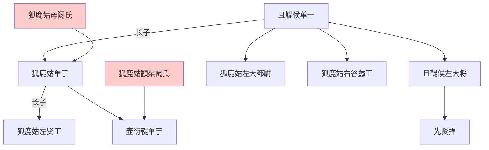
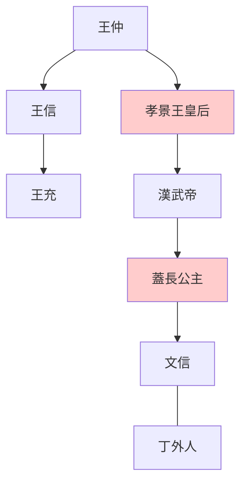
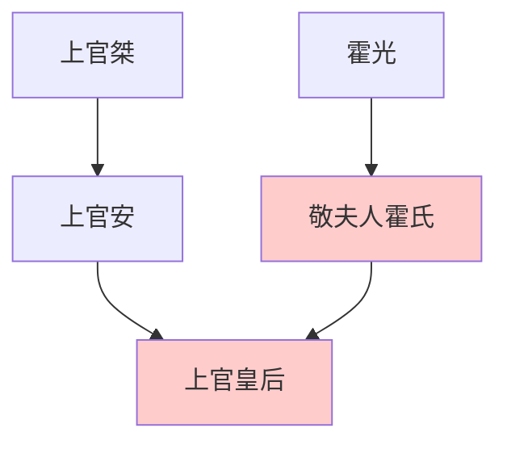

> 2021/4/21->2021/4/30

# 315 卷二十三 汉纪十五

> -86->-75

## 31501 燕王旦反及托孤臣侯
> 夏，益州夷二十四邑、三万馀人皆反->毋令民出今年田租
- 霍光上官桀贪图权位，逼金日磾临死接受封侯

## 31502 匈奴中衰及上官皇后
> 初，武帝征伐匈奴->无在位者

- 匈奴五單于爭立背景，综合31401和31502

- 假設蓋主嫁王充

- 上官皇后世系

## 31503 成方遂及盐铁之议
> 有男子乘黄犊车诣北阙->于是盐铁之议起焉
- 成方遂假冒戾太子，满朝文武不敢妄动，未必单纯是神棍冒充这么简单
- 盐铁之议的主旨是国进民退还是国退民进

## 31504 苏武归国李陵死
> 初，苏武既徙北海上->遂死于匈奴
- 任立政捏脚李陵不归，西门庆捏脚金莲有意

## 31505 燕蓋之亂
> 夏，旱->乃擢义子延寿为谏大夫
- 元鳳政變因反對派人多意見不一致而失敗：燕王旦想奪皇帝位，蓋主想給情人謀取官爵，上官桀父子也想奪皇帝位，桑弘羊想打倒霍光。而霍光漢昭帝派系目的只需維護現有政權，因此成功

## 31506 眭弘预言及漢匈張掖之役
> 大将军光以朝无旧臣->匈奴不敢入张掖

## 31507 侯史吳案及繫乌桓
> 燕、盖之乱->不能复出兵
- 侯史吴案体现了典型的中国式政治关系及政敌清洗过程，隐藏人物侍御史是导火索，最终姓名都是未知的

## 31508 傅介子刺楼兰王
> 春，正月，丁亥，帝加元服->少府河内蔡义为御史大夫
- 傅介子的流氓战狼外交，匹夫之勇兼仗势欺人，竟受万世敬仰
