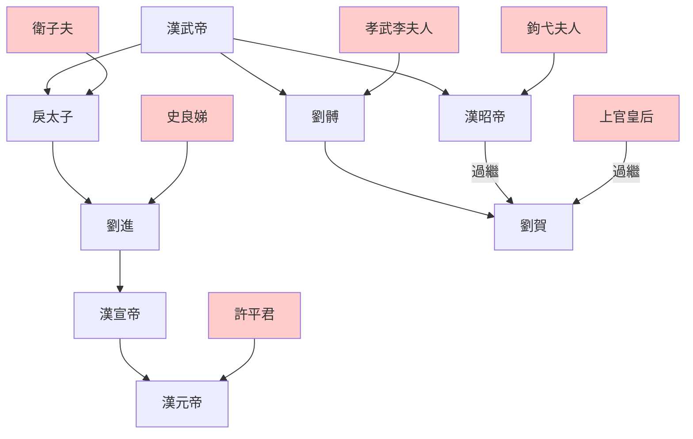
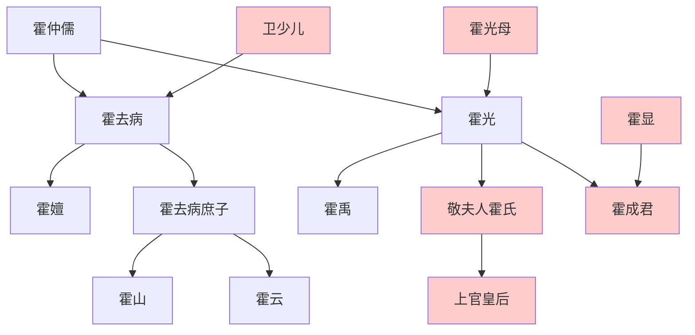

---
export_on_save:
    html: true
---

> 2021/5/1->2021/5/9

# 316 卷二十四 汉纪十六

> -74->-68

## 31601 立刘贺
> 春，二月，诏减口赋钱什三->葬孝昭皇帝于平陵

## 31602 废刘贺
> 昌邑王既立->迁胜长信少府，赐爵关内侯
- 楊敞大事不決直接嚇尿，全靠夫人撐場面
- 劉賀27天搞出1127件壞事，累死眼線和記錄者
- 西漢綬帶顏色

等級|綬帶顏色
--|--
天子|黃赤綬四采，黃赤紺縹
諸侯王|赤綬四采，青黃縹紺
列侯|紫綬二采，紫白
二千石|青綬三采，青白紅
千石、六百石|墨綬三采，青赤紺
四百石、三百石、二百石|黃綬

## 31603 汉宣帝身世及即位
> 初，卫太子纳鲁国史良娣->尊皇太后为太皇太后
- 漢武帝子嗣皇帝示意圖

- 漢宣帝先封侯再即皇帝位，非開國君主甚罕見

## 31604 霍氏专权
> 侍御史严延年劾奏“大将军光擅废立主->礼下之已甚
- 霍光世系

- 霍光給宮女穿上了內褲，漢靈帝給宮女穿上了開襠褲

## 31605 定谥立庙
> 夏，四月，庚午，地震->系再更冬，讲论不怠
- 黃霸雖然是買來的官，然獄中拜師夏侯勝學尚書，堪為佳話。

## 31606 联乌抗匈及毒杀许后
> 初，乌孙公主死->而边境少事矣
- 淳于衍之夫托關系找工作，成為許后之死的誘因

## 31607 良吏盛
> 是岁，颍川太守赵广汉为京兆尹->民自以不冤
- 劉去原為盜墓達人，自從認識陽成昭信，成為虐殺達人
- 各時代盜墓信息

墓主時代|主盜|事蹟
--|--|--
東周|劉去|劉去盜魏襄公、晉靈公，伍子胥主盜楚墓
秦||項羽盜秦陵（劉邦說）
漢|赤眉軍、曹操、董卓|赤眉軍盜劉邦、漢武帝，曹操官營盜梁孝王劉武，漢順帝卒年被九江賊盜，董卓盜漢武帝
唐|溫韜、黃巢|溫韜盜唐十八陵、黃巢盜武則天李治（另盜秦陵、漢武帝）未遂
北宋|劉豫|劉豫盜北宋八陵
南宋|楊璉真迦|楊璉真迦盜所有南宋陵
明朝|陳奉、乾隆|陳奉盜顯陵，乾隆盜朱棣金絲楠木
清朝|孫殿英|孫殿英盜乾隆、慈禧

## 31608 霍光死
> 春，霍光病笃->皆从其议

## 31609 孝宣中興
> 帝兴于闾阎->遂南降汉
