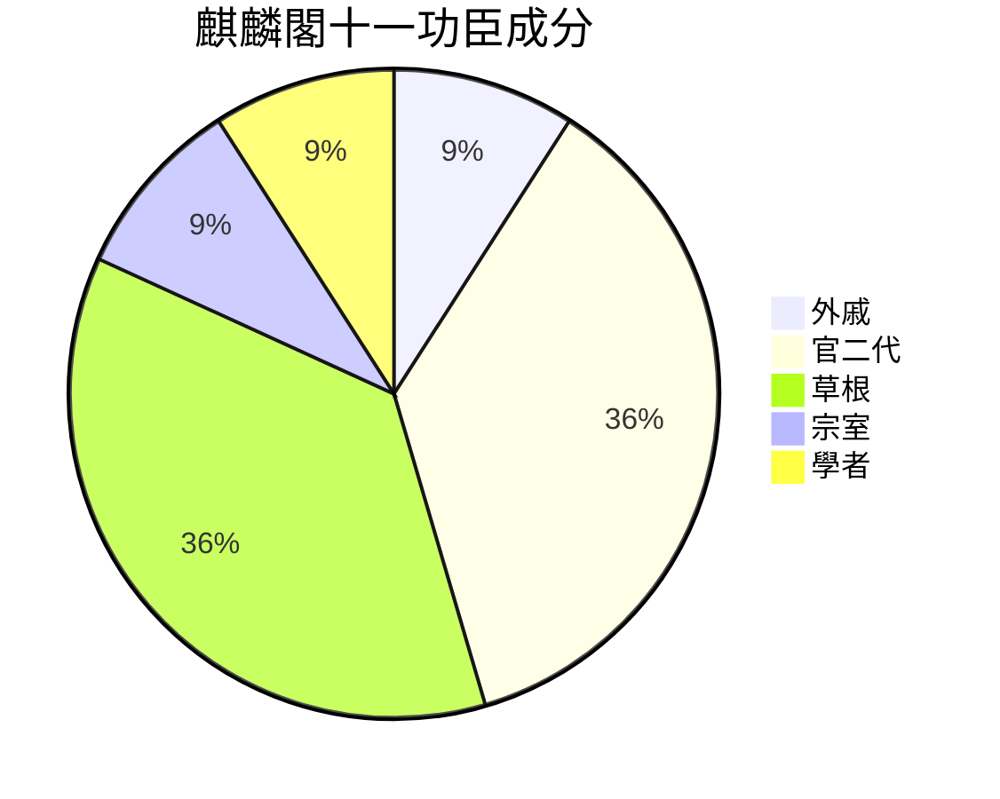

> 2021/5/18->2021/5/24

# 319 卷二十七 汉纪十九

> -58->-49

## 31901 黃霸升遷及嚴延年誅
> 春，二月，以凤皇、甘露降集京师，赦天下->东海莫不贤智其母

## 31902 五單于爭立
> 匈奴握衍朐鞮单于暴虐->乙酉朔，日有食之

- 五單于爭立表

單于|佣立者|備註
--|--|--
呼韓邪單于|姑夕王、烏禪幕、左地貴人|敗握衍朐鞮單于。居東。敗屠耆單于，降車犂單于，复敗烏藉單于。被郅支單于擊敗後降漢。
屠耆單于|都隆奇、右賢王|居西。敗車犂單于、烏藉單于、呼揭單于。被呼韓邪單于敗後自殺。
呼揭單于|自立|讒右賢王被追殺後自立，居西北。車犂單于兵敗投靠，呼揭單于去號臣服。
車犂單于|自立|屠耆單于屬下，原右奧鞬王。被屠耆單于繫至呼揭單于處取而代之。再次被擊敗西北逃。最終降呼韓邪單于。
烏藉單于|自立、李陵子|屠耆單于屬下，原烏藉都尉。被都隆奇擊敗投靠呼揭單于。呼韓邪滅屠耆單于後-56年再次被李陵子擁立，被呼韓邪殺。
閏振單于|自立|屠耆單于從弟，五單于統一後自立居西。攻郅支單于被反殺。
郅支單于|自立|呼韓邪兄呼屠吾斯，左賢王，五單于統一後自立居東。殺閏振單于，擊敗呼韓邪單于。避漢向西方擴張。
伊利目單于|自立|屠耆單于小弟，收屠耆、閏振餘兵自立，被郅支殺。

## 31903 漢臣鬥朝廷及匈奴鬥單于
> 韩延寿代萧望之为左冯翊->岂虚虖哉
- 韓延壽蕭望之爭，韓延壽死；楊惲戴長樂爭，俱貶

## 31904 黃霸拜相及常平倉
> 二月，壬辰，黄霸为丞相->上乃下诏赐寿昌爵关内侯

## 31905 楊惲死張敞活
> 夏，四月，辛丑朔，日有食之->敞到部，盗贼屏迹
- 掌權多年，漢宣帝亦不保清白。趙廣漢被與魏相鬥死，韓延壽被蕭望之鬥死，蓋寬饒、楊惲死於耿直。趙蓋韓楊四人皆可用而冤死，朝臣噤聲，黃霸不識鶡雀不敢言，漸使宦官得權。
- 張敞肆意殺絮舜而漢宣帝護之，能力真到位了殺人不算什麽

## 31906 太子位安及匈奴欲附
> 皇太子柔仁好儒->上素服五日

## 31907 烏孫大小昆彌並立
> 乌孙狂王复尚楚主解忧->然众心皆附小昆弥
- 解憂公主刺殺泥靡未遂，泥靡已失民心而漢賜醫藥。烏就屠殺泥靡而眾心歸附，漢遣馮嫽勸降，並立大小昆彌，烏就屠為小號。烏孫分裂滅國，皆在漢計劃之中。

## 31908 呼韓邪單于來朝
> 春，正月，立皇子嚣为定陶王->咸尊汉矣

## 31909 麒麟閣十一功臣及石渠閣會議
> 上以戎狄宾服->穀梁春秋博士
- 麒麟閣十一功臣成分
  - 外戚：霍光
  - 官二代：張安世、韓增、杜延年、蘇武
  - 草根：趙充國、魏相、丙吉、蕭望之
  - 宗室：劉德
  - 學者：梁丘賀

## 31910 解憂歸國及漢成帝生
> 乌孙大昆弥元贵靡及鸱靡皆病死->常置左右
- 司馬良娣死，為給漢元帝排憂，他爸找來王政君，生漢成帝並指定隔代接班人。如此隨便，使王莽篡位，亂漢家者，亦非太子劉奭，宣帝自己該背鍋。

## 31911 漢宣帝崩
> 夏，廣川王海陽坐禽獸行->皇后曰皇太后
- 變態殺人狂劉去被誅，漢宣帝不忍，封其兄劉文。劉文子劉海陽發明了春宮圖，邀請姐妹來看，又坐禽獸行廢。這一脈變態傳承下來，新的劉海洋又用硫酸開始潑熊。
