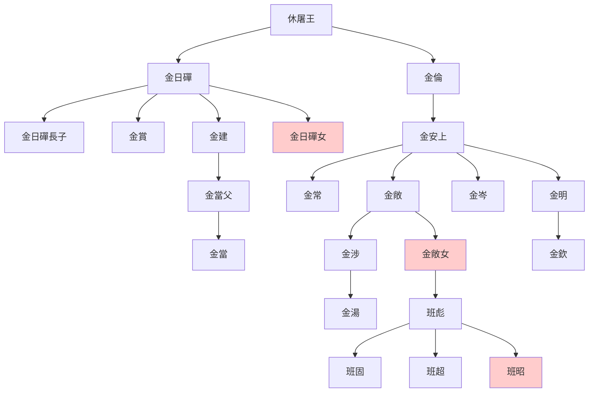

> 2021/5/30->2021/6/5

# 321 卷二十九 汉纪二十一

> -41->-33

## 32101 张猛死及宗廟罷
> 春，二月，冯奉世还京师->用韦玄成等之议也
- 周堪兩貶兩復，劉向兩貶一復，蕭望之張猛一貶一復，而石顯黨穩坐不動，足見漢元帝被溜得團團轉
- 尚书五人党：石显、牢梁、五鹿充宗、伊嘉、陈顺

## 32102 匡衡谏定太子
> 上好儒术、文辞->正家而天下定矣
- 匡衡：盖聪明疏通者戒于太察，寡闻少见者戒于壅蔽，勇猛刚强者戒于太暴，仁爱温良者戒于无断，湛静安舒者戒于后时，广心浩大者戒于遗忘

## 32103 馮媛擋熊
> 初，武帝既塞宣房->立皇子兴为信都王

## 32104 京房諫罷石顯
> 东郡京房学《易》于梁人焦延寿->孝元之谓矣
- 京房出身易学大神，而上绩效考核法、谏罢石显，均为务实事，不过是善于把灾变套用在时事上为己所用。劝罢石显，掰开揉碎指名道姓漢元帝才明白，明白也不动活

## 32105 京房棄市
> 上令房上弟子晓知考功->髡为城旦

## 32106 石顯弄權
> 石显威权日盛->如斯而已矣
- 石顯能呼風喚雨，一怪漢元帝傻，被忽悠瘸了還謝謝。二怪群臣無能，無還手之力。匡衡、韋玄成之流，尸位素餐，甚至貢禹被當做石顯給自己洗脫罪名的棋子，因貪圖名位而欣然樂受；其餘反對派，蕭望之、周堪、張猛、京房被逐個擊破，從未團結過。

## 32107 郅支之戰
> 八月，癸亥，以光禄勋匡衡为御史大夫->群臣上寿，置酒

## 32108 太子不悌及复宗庙
> 六月，甲申，中山哀王竟薨->徙济阳王康为山阳王

## 32109 昭君出塞
> 匈奴呼韩邪单于闻郅支既诛->为右日逐王
- 呂后誅韓信，劉邦且喜且憐之；陳湯誅郅支，呼韓邪且喜且懼
- 李陵為國、叛國、不願歸國，感染匈奴。呼韓邪左伊秩訾為國、叛國、不願歸國

## 32110 止冯野王及召父治民
> 皇太子冠->孝昭太后寝园

## 32111 议封陈汤甘延寿
> 初，中书令石显尝欲以姊妻甘延寿->权其轻重而为之制宜焉

## 32112 定嗣及漢元帝崩
> 初，太子少好经书，宽博谨慎->上敬纳其言
- 漢元帝技藝型人物，若做儒生，或研音樂，終會有所成就。擅長技藝者無拘無束，故舉棋不定，隨性而起，故興盡而去。用在治國之上，必然亡國，漢宣帝未易太子，果然亂漢家，而看中劉驁，更是錯上加錯
- 金日磾及班彪世系

