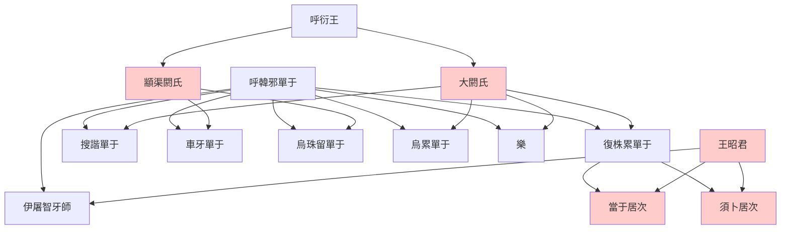

> 2021/6/6->2021/6/14

# 322 卷三十 汉纪二十二

> -32->-23

## 32201 石顯失勢及王氏封侯
> 春，正月，乙丑，悼考庙灾->上优诏不许
- 田氏擅長人海戰術，秦末有田氏三兄弟，西漢末有王家八兄弟

## 32202 九女之制及呼韓邪死
> 御史中丞东海薛宣上疏曰->小女为当于居次
- 呼韓邪世系

## 32203 真假大洪水
> 春，三月，赦天下徒->徙民避水居丘陵九万七千馀口
- 皇家上諾亞方舟，人民上城避水，而大洪水神話被王商揭穿，西漢末的罪惡最終釀成王莽之亂

## 32204 谷永保陳湯
> 壬戌，以少府张忠为御史大夫->莫府事壹决于汤

## 32205 許后專寵及儉省減刑
> 春，杜钦荐犍为王延世于王凤->以塞詔而已

## 32206 伊邪莫演詐降
> 匈奴單于遣右皋林王伊邪莫演等奉獻->徙山陽王康為定陶王

## 32207 一日五侯及王尊免復
> 六月，上悉封諸舅->天子复以尊为徐州刺史

## 32208 陳立滅夜郎
> 夜郎王兴->西夷遂平
- 夜郎王與小夥伴打架，漢使勸架，夜郎王照漢使刻木人，與小夥伴射之

## 32209 劉向校書及王商氣死
> 春，正月，楚王嚣来朝->楚孝王嚣薨
- 秦始皇焚書，胡亥、子嬰而後秦亡；漢成帝校書，哀帝、平帝而後漢亡。打書的主意都會亡國
- 石顯雖死，控制皇帝的技能已被王鳳學會，漢成帝完全保不住王商

## 32210 罷使罽賓
> 初，武帝通西域->三月，赦天下徒
- 杜欽揭示萬國來朝真相：奉獻者皆行賈賤人，欲通貨市買。外國商人借進貢之名，磕幾個頭，騙中國賞賜及使者護送，商人一本萬利，中國花錢買面子

## 32211 王鳳鬥王章冯野王
> 京兆尹泰山王章下狱，死->凤白行其策焉
- 王鳳逗死王商、王章，使王家專權
- 羌胡殺首子盪腸，如有此法則楚幽王哀王不再，秦始皇不再

## 32212 劉向諫防王氏篡權
> 是岁，陈留太守薛宣为左冯翊->徙信都王兴为中山王
- 劉向雖忠於漢室，預言王氏篡漢，而解決辦法仍是重用外戚，在七國之亂與霍禹之亂間拉鋸而已。