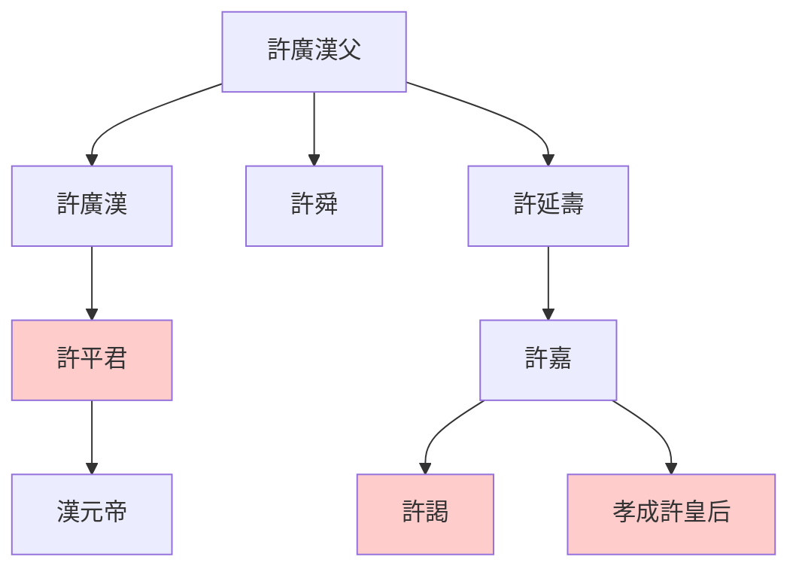
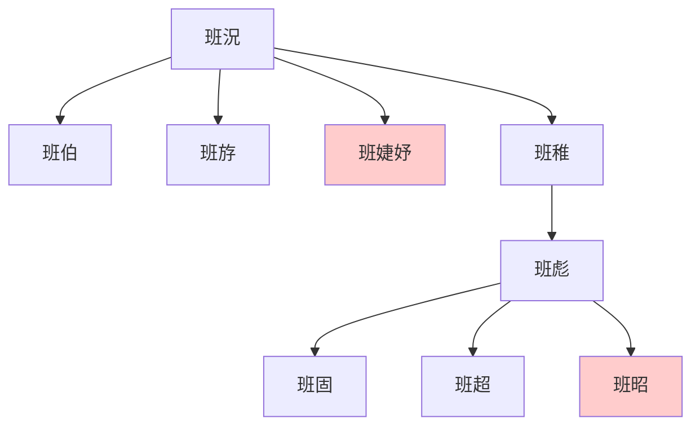

> 2021/6/14->2021/6/21

# 323 卷三十一 汉纪二十三

> -22->-14

## 32301 王鳳死及烏孫小昆彌復仇
> 春，三月，壬戌，陨石东郡八->奉初陵

## 32302 漢成帝微行及雊雉之异
> 上始為微行->災變尚可銷也
- 漢武帝微行，喜歡冒充平陽侯曹時；漢成帝微行，喜歡冒充富平侯張放家人

## 32303 起昌陵及五侯奢侈
> 初，元帝儉約->孝景庙北阙灾

## 32304 趙氏姐妹鬥許后班婕妤
> 初，许皇后与班婕妤皆有宠于上->上许焉
- 許平君世系

- 班氏世系

## 32305 鄭躬起義及杜鄴調解音商
> 广汉男子郑躬等六十馀人攻官寺->戾后园南阙火
- 夏朝四輔臣：左輔、右弼、前疑、後丞

## 32306 趙飛燕立后
> 上欲立赵婕妤为皇后->论为鬼薪

## 32307 王莽成名及趙氏絕幸
> 初，太后兄弟八人->然卒无子

## 32308 劉向著書及罢昌陵
> 光禄大夫刘向以为王教由内及外->令天下毋有动摇之心
- 墳形製

階級|墳高|樹木
--|--|--
天子|三仞|松
諸侯|一仞半|柏
大夫|八尺|藥草
士|四尺|槐
庶人|無|楊柳

- 劉向所言牧豎之焚：牧童找丟失的羊，失火燒了秦始皇棺槨
- 初言昌陵三年可成，五年而罷，甩鍋解萬年，漢成帝責任亦不小

## 32309 續封蕭何之後
> 初，酂侯萧何之子孙嗣为侯者->京兆尹翟方进为御史大夫

## 32310 谷永切諫而上怒
> 谷永为凉州刺史->上意亦解，自悔
- 谷永：王者以民為基，民以財為本，財竭則下畔，下畔則上亡

## 32311 遠張放擢方進徙陳湯
> 上尝与张放及赵、李诸侍中共宴饮禁中->皆免官

## 32312 漢成帝好鬼神
> 是岁，琅邪太守朱博为左冯翊->上善其言

## 32313 起義四起及梅福諫重賢納言
> 十一月，尉氏男子樊并等十三人谋反->上不纳
- 民有三年之儲曰升平
