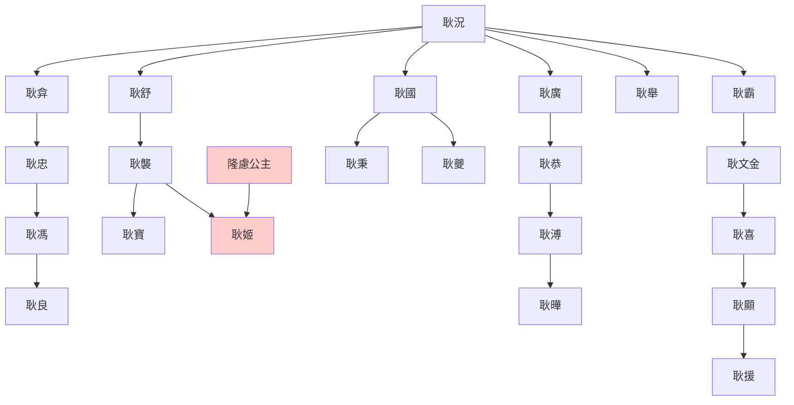
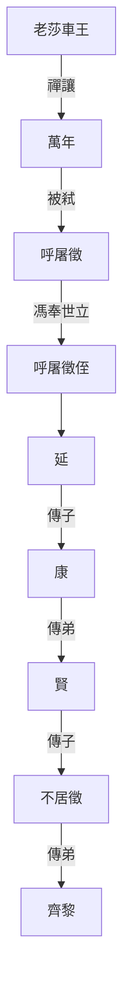

> 2021/8/9->2021/8/16

# 502 卷四十一 汉纪三十三

> 27->29

## 50201 平赤眉
> 春，正月，甲子，冯异为征西大将军->帝赦不诛
- 湖縣之戰：赤眉佯敗棄假糧草，漢軍中計，鄧禹馮異大敗，吊兒郎當赤眉軍的迴光返照
- 崤底之戰：馮異遣人偽裝赤眉大敗之，降八萬
- 赤眉降光武，光武說不服可以打一架決勝負，徐宣說這是找到組織了特別高興，光武說你真是鐵中錚錚庸中佼佼者

## 50202 張步彭寵割據及誅鄧奉
> 二月，刘永立董宪为海西王->复朱祜位

## 50203 平關中寇及廣樂之戰
> 延岑既破赤眉->自将兵助延围睢阳

## 50204 延岑奔秦豐及斬劉永
> 车驾自小长安引还->众十馀万

## 50205 隗囂臣田戎破張豐誅
> 帝谓太中大夫来歙曰->當死無恨
- 逗逼張豐死前椎破假玉璽，終於知道被騙，可謂朝聞道夕死可矣

## 50206 蘭陵之戰及圍李憲
> 上詔耿弇進擊彭寵->冬，十月，甲寅，车驾还宫
- 不聽光武言，敗仗在眼前，故雲台二十八將存在感低。蘭陵之戰是將領拖皇帝後腿的典型
- 耿氏世系

## 50207 馬援比二帝及制衡公孫述
> 隗嚣使马援往观公孙述->反復勝邪

## 50208 垂惠之戰及彭寵死
> 二月，丙午，大赦->無乃異於是乎
- 垂惠之戰，王霸賣隊友獲得士氣，大敗敵軍
- 完美綁票撕票計劃：彭寵寫通關文書，妻縫縑囊，事成，子密斬二人首置囊中，持通關文書遠走，奔漢封侯

## 50209 龐萌反漢及田戎亡蜀
> 帝以扶風郭伋為漁陽太守->夏，四月，旱，蝗
- 劉平身被七創護衛楚郡太守孫萌，以創血解其渴

## 50210 班彪投竇融及竇融向漢
> 隗嚣问于班彪曰->以为天子明见万里之外

## 50211 誅秦豐及劉秀破董憲之戰
> 朱祜急攻黎丘->帝幸鲁

## 50212 祝阿臨淄之戰
> 张步闻耿弇将至->未尝挫折焉

## 50213 盧芳據九原及馮異治關中
> 初起太学->而有惧意

## 50214 隗囂兩端猶豫
> 隗嚣矜己饰智->于是游士长者稍稍去之

## 50215 江南臣漢及處士不臣
> 王莽末->五十五国皆属焉
- 莎車王世系

