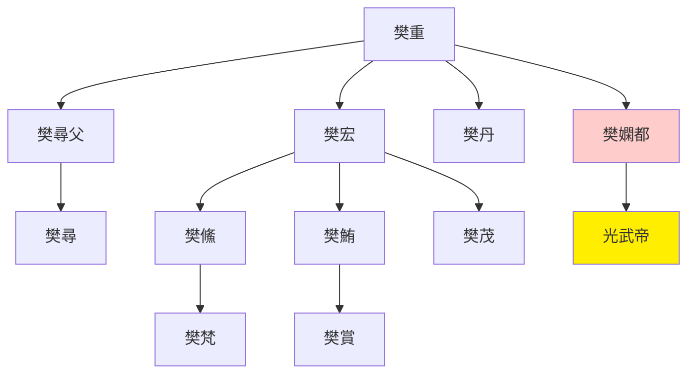
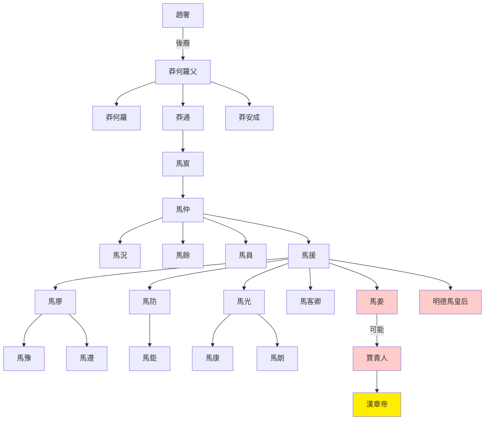

> 2021/9/8->2021/9/16

# 506 卷四十五 汉纪三十七

> 61->75

## 50601 廣德擊莎車及竇融死
> 春，帝近出观览城第->诏还融夫人与小孙一人居雒阳
- 飛書：匿名信

## 50602 宗均治九江及佛教傳入
> 春，二月，王雒山出宝鼎->独楚王英最先好之
- 殘吏為檻穽而虎暴不絕，宗均廢之而虎患除。中國早期生態保護成功案例
- 西遊記人物原型

人物|原型
--|--
唐僧|玄奘：歷史人物，唐代高僧
孫悟空|無支祁：道教齊天大聖、石磐陀：敦煌壁畫中猴形人、哈奴曼：印度護法神猴、釋悟空：歷史人物，唐代高僧
豬八戒|朱士行：歷史人物，三國高僧、野豬瓦拉哈：毗濕奴第三次化身野豬
沙僧|可能與沙門有關，形象參考西域胡人
白馬|可能與白馬寺有關

- 佛教自天竺傳入，僧人應居使館區，名鴻臚寺，鴻臚寺地方不夠，建白馬寺專門譯經，寺逐漸成為佛教建築的代稱

## 50603 鄭眾不拜匈奴及劉荊死
> 壬寅晦，日有食之，既->广陵思王荆自杀，国除
- 四姓小侯：樊、郭、陰、馬

## 50604 哀牢歸漢及王景治河
> 夏，四月，戊子，赦天下->冬，十月，壬辰晦，日有食之
- 黃河改道概況

名稱|六大遷徙|年份|時代|改道概況
--|--|--|--|--
大禹治水|||上古|黃河泛濫，修築禹河
禹河大徙|1|-602|周定王五年|黎陽宿胥口決徙，偏離禹河故道
|||-168|漢文帝十二年|酸棗決堤，漢代最早一次決口
|||-109|漢武帝元封二年|瓠子河決口，武帝親臨，郭昌塞決成功
魏郡改道|2|11|王莽始建國三年|魏郡決口，至70年王景治理後安流
橫隴改道||1034|宋仁宗景祐元年|澶州橫隴埽決口，分為多支東北入海，至1041年下詔暫停修決
商胡改道|3|1048|宋仁宗慶曆八年|衝決澶州商胡埽，分為北流、東流(二股河)。三易回河三次堵塞北流。東流1099年斷絕。
||4|1128|宋高宗建炎二年|杜充抗金決堤，滑州改道，開始黃河奪淮。1168年李固渡決口，1194年陽武決堤，1234年蒙古軍決黃河寸金淀。
|||1286|元世祖至元二十三年|開封等十五處決口
|||1297|元成宗大德元年|杞縣蒲口決堤，汴梁被淹
|||1344|元惠宗至正四年|白茅口決堤，賈魯堵住缺口
||5|1391|明洪武二十四年|原武黑洋山決口，賈魯舊河淤。劉大夏、潘季馴治河。1572年穩固歸一
咸豐黃河大改道|6|1855|清咸豐五年|銅瓦廂決口，結束黃河奪淮。
花園口決堤事件||1938|民國二十七年|國軍為阻擋日本軍，炸毀花園口堤

## 50605 楚王英死及窮治楚獄
> 楚王英與方士作金龜->乙巳，赦天下
- 南陽樊氏世系

## 50606 出擊北匈奴及祭肜死
> 謁者僕射耿秉數上言請擊匈奴->竇固獨有功，加位特進

## 50607 班超通西域
> 固使假司馬班超與從事郭恂俱使西域->超，彪之子也

## 50608 徙劉延夢先帝劉睦死
> 淮阳王延->昱，永之子也
- 廉范以二火把自製十字架，燃三頭持一頭冒充救兵，以此破敵

## 50609 白狼歌定疏勒守車師
> 益州刺史梁国朱辅宣示汉德->以为神明，遂引去
- 魔法英雄耿恭，毒箭使人傷口沸騰，划地可召喚泉水

## 50610 漢明帝崩及救耿恭
> 八月，壬子，帝崩于东宫前殿->京师及兗、豫、徐州大旱

- 扶風馬氏世系

