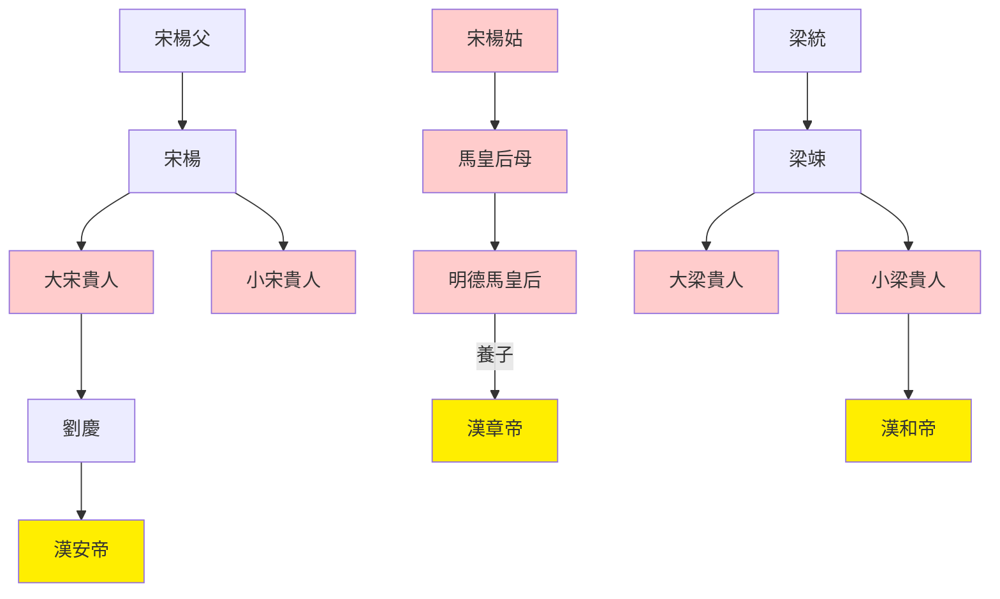

> 2021/9/17->2021/9/23

# 507 卷四十六 汉纪三十八

> 76->84

## 50701 開邊爭論及十三將士歸玉門
> 春，正月，诏兗、豫、徐三州禀赡饥民->疏勒复安
- 耿恭死守的西域，漢章帝視同雞肋，不合時宜的民族氣節，只配感動親朋好友

## 50702 劉蒼屢諫及平哀牢
> 甲寅，山阳、山平地震->诏还坐楚、淮阳事徙者四百馀家

## 50703 馬后拒封及諸馬修德
> 上欲封爵诸舅->太后深纳之

## 50704 征西羌及第五倫諫寬厚
> 初，安夷县吏略妻卑湳种羌人妇->立贵人窦氏为皇后

## 50705 諸馬封馬后崩及白虎觀會議
> 初，显宗之世->超之兄也

## 50706 班超諫擊龜茲
> 春，二月，庚辰朔，日有食之->帝纳之

## 50707 廉范治蜀及廢劉慶
> 春。二月，辛卯，琅邪孝王京薨->出則同輿
- 二宋二梁貴人世系

## 50708 劉蒼死諸馬敗竇氏貴
> 己未，徙廣平王羨為西平王->人主之深戒也

## 50709 班超去妻及韋彪得用
> 下邳周纡为雒阳令->以大司農鄭弘為太尉
- 班超去妻與吳起殺妻，五十步笑百步

## 50710 朱暉強直孔僖誹謗平定疏勒
> 癸酉，詔改元->乌即城遂降
