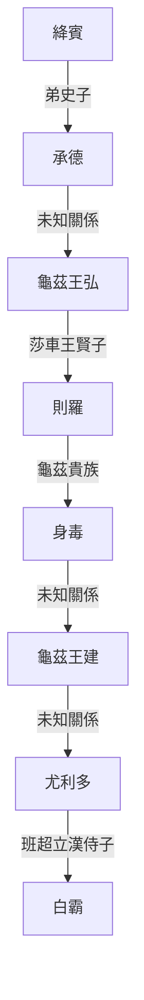

> 2021/9/24->2021/9/30

# 508 卷四十七 汉纪三十九

> 85->91

## 50801 四分曆及祭孔祭祖
> 春，正月，乙酉，诏曰->止用冬初十月而已
- 六代之樂

朝代|樂舞名|別名|用途
--|--|--|--
黃帝|雲門|雲門大卷|文舞，祭祀天神
堯|咸池|大咸、大章|文舞，祭祀地神
舜|大韶|韶|文舞，祭祀四望
禹|大夏||文舞，祭祀山川
湯|大護|大濩|武舞，祭祀姜嫄
周|大武||武舞，祭祀周朝祖先

## 50802 還生口鄭弘死擒號吾斬疏勒
> 冬，南单于遣兵与北虏温禺犊王战于涿邪山->南道遂通
- 北匈奴約與漢合市，南匈奴劫掠之。漢加倍奉還所劫，並賞賜南匈奴。二匈奴仍冥冥之中共食漢
- 漢章帝知鄭弘忠竇憲專權而不能治，皇權頹勢已明

## 50803 曹褒制禮及斬迷吾降莎車
> 楚许太后薨->自是威震西域
- 漢龜茲王世系

## 50804 議遣諸王及漢章帝崩
> 春，正月，济南王康->为休兰尸逐侯鞮单于

## 50805 竇后臨朝及議擊北匈奴
> 太后临朝->诚不可许
- 西漢皇后外戚結局表

皇帝|后妃|結局|重要外戚|結局
--|--|--|--|--
劉邦|呂后|臨朝稱制|呂台、呂祿、呂產|誅呂安劉
漢惠帝|孝惠張皇后|善終|張敖|未成外戚集團，善終
漢文帝|薄姬(太后)|善終|薄昭|文帝賜死
漢文帝|孝文竇皇后|善終|竇嬰|武帝處死
漢景帝|孝景王皇后|善終|田蚡|暴病索命死
漢武帝|孝武陳皇后|打入冷宮|無|
漢武帝|衛子夫|死於巫蠱之禍|衛青|善終
漢武帝|鉤弋夫人|立子殺母|無|
戾太子|史良娣|死於巫蠱之禍|史恭|未成外戚集團，善終
漢昭帝|上官皇后|善終|上官桀、上官安|燕蓋之亂誅
劉賀|李夫人(太后)|早死|李延年、李廣利|李廣利降匈奴
漢宣帝|許平君|被霍顯毒殺|許廣漢、許舜、許延壽、許嘉|均善終
漢宣帝|霍成君|霍禹之亂族誅|霍光、霍禹|霍禹之亂族誅
漢宣帝|邛成太后|善終|王奉光|善終
漢元帝|王政君|善終|王鳳、王莽|建立新朝
漢元帝|馮婕妤(妃)|被史立誣死|馮逡、馮野王|善終
漢成帝|孝成許皇后|被廢、賜死|無(許嘉後裔)|
漢成帝|趙飛燕|平帝時自殺|趙臨、趙欽|未成外戚集團，不明
漢哀帝|丁姬(太后)|死後被王莽虐尸|丁明、丁望、丁滿|未成外戚集團，不明
漢哀帝|孝哀傅皇后|平帝時被王莽廢而自殺|傅晏、傅喜|善終
漢平帝|衛姬(太后)|日夜啼泣|無|
漢平帝|孝平王皇后|新滅時自焚|王莽|建立新朝

## 50806 竇憲刺劉暢及鄧訓平燒當
> 会齐殇王子都乡侯畅来吊国忧->分以屯田、修理坞壁而已
- 燕然勒石連環問
  - 北匈奴孱弱，擊之無益，為什麼要勞師遠征？
  - 因為竇憲要贖罪。竇憲有什麼罪？
  - 殺人。為什麼不償命，還能去當將軍？
  - 因為他是太后的哥哥，殺的是太后的情人。
- 缝革为船，置于箄上以渡河：鄧訓製羊皮筏子破迷唐

## 50807 眾諫不征北匈奴不聽
> 窦宪将征匈奴->寿，恽之子也

## 50808 燕然勒石及竇氏嬌縱
> 夏，六月，窦宪、耿秉出朔方鸡鹿塞->无所嫌牾焉

## 50809 退貴霜及金微山之戰
> 冬，十月，庚子，阜陵质王延薨->封夔为粟邑侯

## 50810 竇憲專權廢立龜茲立於除鞬
> 窦宪既立大功->然上竟从宪策
