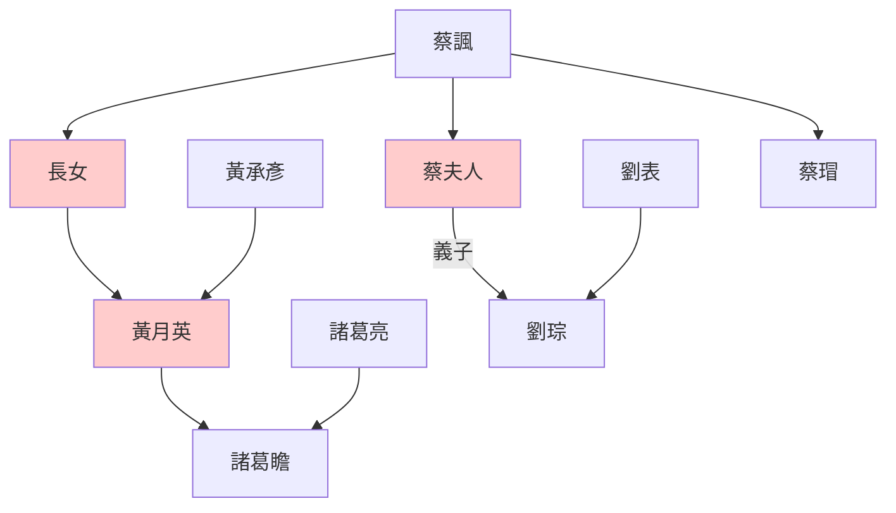

> 2021/10/18->2021/10/27

# 511 卷五十 汉纪四十二

> 116->124

## 51101 刺平先零羌
> 春，正月，苍梧、郁林、合浦蛮夷反->骘髡妻及凤以谢罪
- 刺殺先零羌

遇刺者|身份|刺客|委託人|備註
--|--|--|--|--
杜琦|聯羌叛亂領袖|杜習|漢陽太守趙博|
杜季貢|聯羌叛亂領袖，投零昌為將軍|榆鬼|任尚|杜季貢為杜琦弟，零昌主將
零昌|先零羌首領|號封|任尚|滇零子，年幼即位
狼莫|先零羌謀主|雕何|鄧遵|

- 漢羌戰爭，歷來以漢耍流氓始。十年戰爭始於罷西域都護，強迫羌人遷往西域。鄧騭討羌大敗，因裙帶而封侯。抵擋羌人不過，強迫漢人搬遷，激發杜琦杜季貢聯羌叛亂。漢朝靠瘋狂刺殺和國力消耗，歷時十年終於平息戰爭。首領零昌、大將軍杜季貢、謀主狼莫均死於漢軍刺殺，力壓公孫述。戰爭花費240億，人相食的景象屢屢出現。最終主將任尚與鄧遵爭功，鄧遵因裙帶關係處死任尚，整場鬧劇完美閉幕。

## 51102 破封離及疏勒強
> 是岁，郡国十四地震->濟北惠王壽薨

## 51103 班勇爭論及置西域副校尉
> 北匈奴率車師後王軍就共殺後部司馬及敦煌長史索班等->河西大被其害

## 51104 治諸羌及鄧后崩
> 沈氐羌寇张掖->歲還豐穰
- 蔡諷蔡瑁世系圖

## 51105 廣納賢才及宦官滅諸鄧
> 上始親政事->诸从兄弟皆得归京师

## 51106 宦豎阿母橫行及楊震諫不聽
> 帝以耿贵人兄牟平侯宝监羽林左军车骑->书奏，皆不省
- 翟酺：夫致貴無漸，失必暴；受爵非道，殃必疾。

## 51107 麻奴反及罷三年喪
> 秋，七月，己卯，改元，赦天下->灭其天性乎

## 51108 馮緄辨假詔及遂成麻奴降
> 十二月，高句骊王宫率马韩->京师及郡国二十七雨水

## 51109 陳忠諫抑伯榮與尚書
> 帝数遣黄门常侍及中使伯荣往来甘陵->万世之法也

## 51110 眾譽黃憲及議保西域
> 汝南太守山阳王龚->将兵五百人出屯柳中
- 黃憲聲名遠播，歷史記錄只有對他的讚美而無正經事跡可考。但所有黃憲的粉絲都人五人六，可知是共同塑造一個假偶像，以帶動各位粉絲的聲名

## 51111 楊震不合污及班勇復西域
> 秋，七月，丹杨山崩->历魏郡、河内而还

## 51112 楊震死
> 初，樊丰、周广、謝惲等見楊震連諫不從->以大鸿胪耿宝为大将军

## 51113 廢太子劉保及來歷獨諫
> 王圣、江京、樊豐等譖太子乳母王男、廚監邴吉等->三十六大水、雨雹
- 乳母之戰改寫歷史：漢安帝乳母王聖，與太子漢順帝乳母王男不和，聯合宦官殺王男，怕太子報復，聯合漢順帝殺母後媽閻姬，廢太子。不久漢安帝崩，閻姬與宦官學趙高秘不發喪，立北鄉侯而速死，漢順帝集結另一波宦官滅閻姬和從屬宦官而即位，從此開啟宦官時代。
