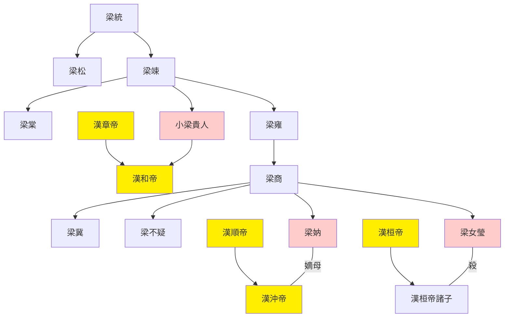
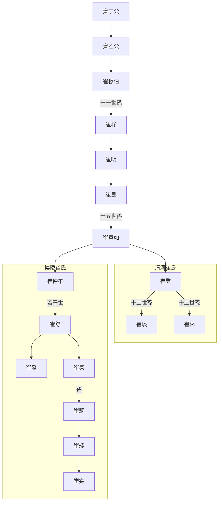

---
export_on_save:
  html: true
---

> 2021/11/14->2021/11/21

# 514 卷五十三 汉纪四十五

> 146->156

## 51401 毒殺漢質帝及強立漢桓帝
> 夏，四月，庚辰，令郡、国举明经诣太学->尊帝母匽氏为博园贵人
- 麵條歷史上首次出現，為梁冀給漢質帝下毒，我下面給你吃自古以來不是好詞

## 51402 封諸梁宦官及劉鮪之亂
> 滕抚性方直->徙桂陽，自殺

## 51403 李固杜喬暴尸
> 梁冀因誣李固、杜喬->伊陵尸逐就單于車兒立

## 51404 荀氏八龍及潁川四長
> 春，正月，甲子，帝加元服->必欲保身全家，尔道为贵
- 顓頊高陽氏才子八人，號八愷：蒼舒、隤敱(音頹皚)、檮戭(音陶演)、大臨、厖降(音忙翔)、庭堅、仲容、叔達
- 陳寔幫領導抗住上級走後門的安排，被譽為有德之人，官官相護帶出新節奏
- 國佐話說得太滿，被殺，名士之間以此官場哲學為戒，是真官員自雞賊

## 51405 梁妠崩及梁冀孫壽橫暴
> 春，正月，甲子，赦天下。改元->然素重穆，亦不甚罪也
- 梁冀敬重朱穆、怕老婆、喜歡小兔子，這是所有的優點

## 51406 監視梁不疑
> 冀遣书诣乐安太守陈蕃->冬，十月，司空胡廣致仕
- 梁氏世系圖

## 51407 崔寔政論
> 十一月，辛巳，京師地震->斯不易之常道矣
- 崔氏世系圖

## 51408 褒崇梁冀及于窴動亂
> 闰月，庚午，任城节王崇薨->而竟不能讨也

## 51409 朱穆開棺及阿羅多反復
> 丙辰，京师地震->司隸、冀州饑，人相食
- 朱穆開趙忠父棺虐尸，漢桓帝抓住又放了。朱穆是梁冀的人，趙忠是漢靈帝他媽，論輩分得叫一聲老妹，太學生劉陶作攪屎棍為朱穆鳴冤，外戚宦官士人輪流登場，桓帝躺平觀看

## 51410 劉陶上疏及張奐酹酒還金
> 太學生劉陶上疏陳事曰->无不悦服，威化大行

## 51411 檀石槐崛起及段颎斬公孫舉
> 春，三月，蜀郡属国夷反->梁胤子桃为城父侯
- 潁川四長：荀淑-當塗長、韓韶-嬴長、陳寔-太丘長、鍾皓-林慮長
- 涼州三明：皇甫規-字威明、張奐-字然明、段颎-字紀明
