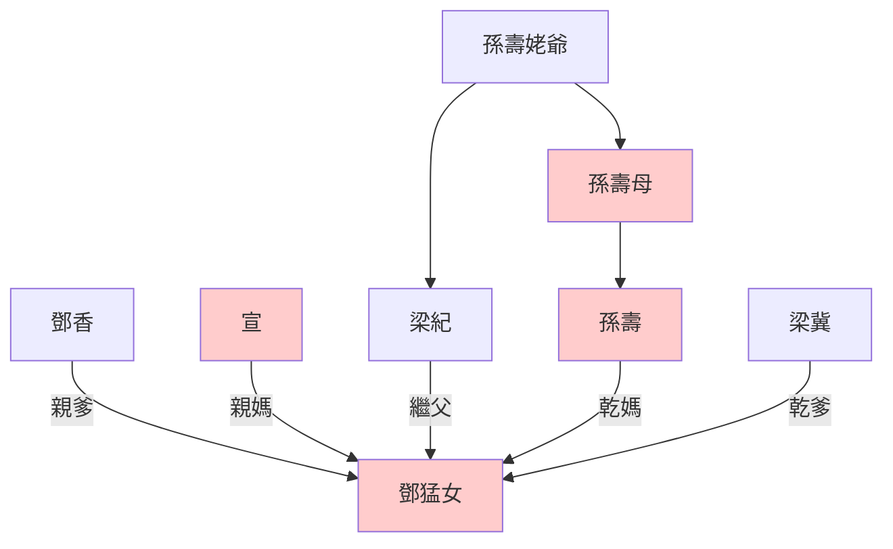
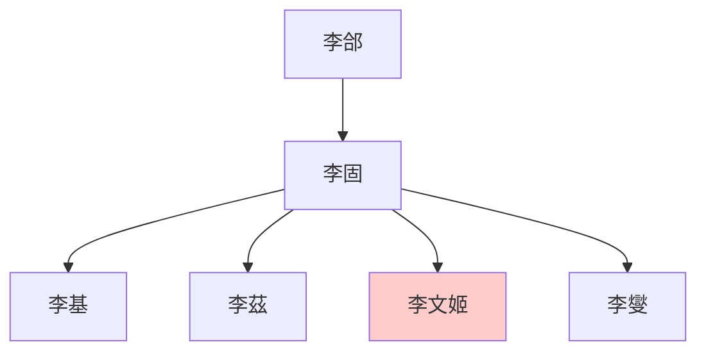

---
export_on_save:
  html: true
---

> 2021/11/22->2021/11/29

# 515 卷五十四 汉纪四十六

> 157->163

## 51501 劉陶諫止改鑄
> 春，正月，己未，赦天下->遂幸上林苑
- 日食之變常有，太史令陳授因劾梁冀，令之後的宦官五侯徐璜上書，漢桓帝在背後指使的可能性很大。何況陳授被弄死後桓帝表現出來的是怒，可解釋為計策失敗而生氣

## 51502 平叛南匈奴及陳龜絕食死
> 十二月，南匈奴诸部并叛->鲜卑寇辽东

## 51503 廁中誅梁冀
> 梁皇后恃姊、兄廕势->以业穷民
- 漢桓帝忍無可忍，和五個太監在廁所里定計誅梁冀，咬破一個太監的胳膊歃血為盟，終於成功。醒來發現皇后還姓梁，怒改姓薄，最後發現人家其實姓鄧。其父香，其女猛

## 51504 立鄧猛封五侯徵處士
> 壬午，立梁贵人为皇后->遂隐身不出
- 鄧猛女關系圖

- 奇葩五處士
  - 徐稚：黃瓊徵辟不來，死後不請自來
  - 姜肱：兄弟三人一起睡，結婚後輪流回家
  - 袁閎：自建土屋死宅不出
  - 韋著：以清節隱士聞名，為官後亂政人設崩塌
  - 李曇：後媽虐待，保持苦孝

## 51505 李雲杜眾同日死
> 帝既诛梁冀->获生口万馀人
- 李杜組合匯總

人物|組合名|死亡時期|事跡
--|--|--|--
李固、杜喬|大李杜|漢質帝死後，漢桓帝初即位|支持立劉蒜反對立漢桓帝，被梁冀殺死暴尸
李雲、杜眾||漢桓帝中期，梁冀死後|諷刺漢桓帝封宦官五侯激怒被殺，杜眾陪死
李膺、杜密|小李杜|漢靈帝初期，第二次黨錮之禍|黨錮之禍被殺
李白、杜甫|大李杜|唐玄宗晚期，安史之亂|詩仙、詩聖
李商隱、杜牧|小李杜|唐宣宗晚期|小李杜

## 51506 陷第五種及陳蕃爰延進諫
> 诏复以陈蕃为光禄勋->延称病，免归

## 51507 李固孤兒及五侯虐遍天下
> 春，正月，丙申，赦天下->遇赦，乃敢出
- 李固世系

## 51508 段熲破諸羌及父老送劉寵
> 闰月，西羌馀众复与烧何大豪寇张掖->為人選一大錢受之

## 51509 段熲下獄及皇甫規平羌
> 冬，先零、沈氐羌與誅種羌寇幷、涼二州->沈氐大豪滇昌、飢恬等十餘萬口復詣規降

## 51510 郡守逃跑及平定荆州
> 夏，四月，長沙賊起->以太常杨秉为太尉
- 漢安帝時期愚忠如嚴授，與張顯俱死，朝廷加封烈士；漢桓帝時期，大家都明白烈士無卵用，瘋狂逃跑，甚至李肅斬胡爽以明志
- 漢桓帝中晚期宮殿瘋狂火災

## 51511 皇甫規下獄及漢桓帝遊獵
> 皇甫规持节为将->书奏，不纳

## 51512 三明复及朱穆死
> 十一月，司空刘宠免->愤懑发疽卒
