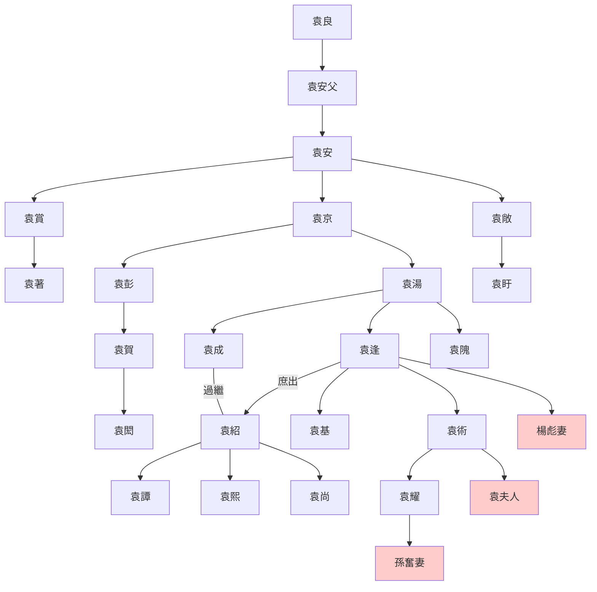

---
export_on_save:
  html: true
---

> 2021/12/6->2021/12/12

# 517 卷五十六 汉纪四十八

> 167->171

## 51701 竇武求情及黨人赦
> 春，正月，东羌先零围祋祤->遂闭口不食，七日而死
- 楊喬未死於黨錮之禍，因貌美被漢桓帝相中，欲嫁公主，死活不從絕食而死

## 51702 漢桓帝崩及段熲擊先零
> 秋，八月，巴部言黄龙见->尊帝母董氏为慎园贵人
- 郡人泡澡戲言有黃龍，被當做祥瑞匯報，後有青蛇出御座之上
- 無慮：總計

## 51703 封賞及對羌策略分歧
> 夏，四月，戊辰，太尉周景薨->宗正刘宠为司空

## 51704 竇武辛亥政變
> 初，窦太后之立也->固辞不受

## 51705 蛇妖出及謝弼死
> 以司徒胡广为太傅->故致位公辅

## 51706 段熲平東羌先零
> 诏遣谒者冯禅说降汉阳散羌->夤擊破之

## 51707 第二次黨錮之禍
> 初，李膺等雖被廢錮->党禁未解而卒
- 漢元帝問：什麼是廷尉？漢靈帝問：什麼是鉤黨？
- 范滂育子奇談：想讓你當壞人，但做壞人是不對的；想讓你當好人，我就是好人，現在要去赴死了。
- 張儉望門投止，害死十多家人，逃亡塞外，苟延殘喘二十餘年，至亂世出英雄之際，卻並無建樹

## 51708 救援黨人及汝南袁氏
> 初，中常侍张让父死->卓乎其不可及已
- 汝南袁氏世系

## 51709 孟佗發跡及討疏勒不克
> 庚子晦，日有食之->鲜卑寇并州
- 孟佗散盡家財討好權宦張讓他家看門大爺，換來一次看門大爺給他下拜的機會。孟佗把機會用在車水馬龍的地方，讓其它行賄者以為他是張讓的尊客，轉向賄賂他。孟佗收下這些賄賂，轉而賄賂張讓，得封涼州刺史。
