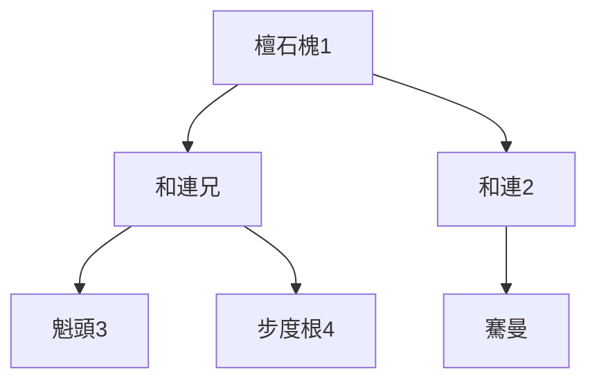
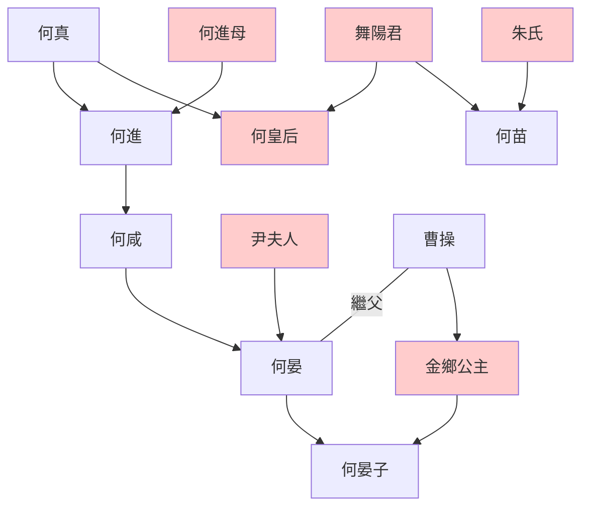

---
export_on_save:
  html: true
---

> 2021/12/21->2021/12/27

# 519 卷五十八 汉纪五十

> 181->187

## 51901 朱儁平交趾及導行费
> 春，正月，初置騄骥厩丞->书奏，不省
- 檀石槐世系

- 漢靈帝開創鴻都門學，cos小販，給狗帶冠，親駕四驢，是第一位文藝玩家皇帝

## 51902 何后殺王榮及降板楯蠻
> 何皇后性强忌->五原山岸崩
- 板楯七姓（七姓夷王）：羅、朴、督、鄂、度、夕、龔

## 51903 黃巾起義
> 初，巨鹿张角奉事黄、老->安平、甘陵人各执其王应贼

## 51904 黨錮解及十常侍
> 三月，戊申，以河南尹何进为大将军->收掠，死狱中
- 忠義太監呂強，出淤泥而不染，一心為黨人，被同僚殺死

## 51905 長社之戰及曹操出
> 庚子，南阳黄巾张曼成攻杀太守褚贡->操大喜而去

## 51906 傅燮諫交趾平黃巾敗米賊起
> 朱儁之擊黃巾也->詔嵩討角

## 51907 滅黃巾及涼州之亂
> 九月，安平王續坐不道->十二月，己巳，赦天下，改元

## 51908 增賦稅鑄銅人修宮室
> 豫州刺史太原王允破黄巾->以朱儁为右车骑将军

## 51909 盜賊並起及議棄涼州
> 自张角之乱->帝善而从之

## 51910 皇甫嵩免劉陶死討涼州
> 夏，四月，庚戌，大雨雹->坚遂出

## 51911 傅燮出京畢嵐發明
> 是岁，帝造万金堂于西园->拜苗为车骑将军
- 何皇后世系

## 51912 韓遂火併傅燮戰歿張純張舉起義
> 韓遂殺邊章及北宮伯玉、李文侯->愧于先之
- 傅燮負文武之才，染腐儒之愚忠，求名而忘身，縱數千敵軍所請，寧死不悟。
