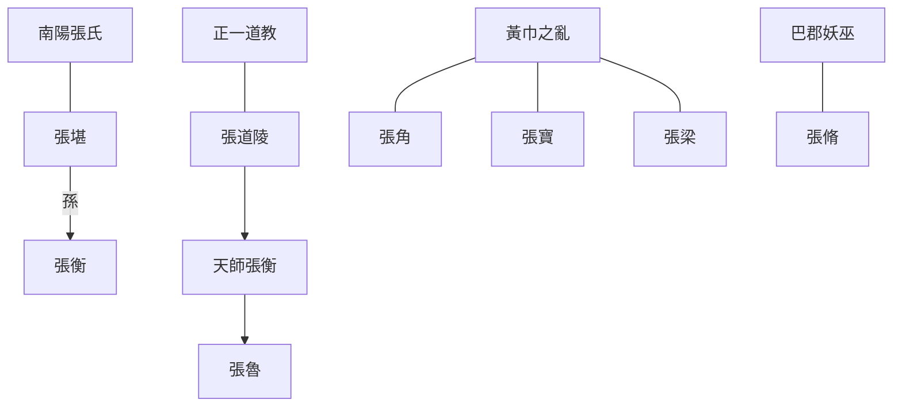

---
export_on_save:
  html: true
---

> 2022/1/5->2022/1/13

# 521 卷六十 汉纪五十二

> 191->193

## 52101 議立劉虞及陽人之戰
> 春，正月，辛丑，赦天下->即调发军粮

## 52102 孫堅破董卓及董卓還長安
> 坚还屯->以太常马日磾为太尉

## 52103 韓馥讓冀州
> 初，何进遣云中张杨还并州募兵->以书刀自杀

## 52104 陽城之戰及二袁決裂
> 鲍信谓曹操曰->又悉改置郡、縣守、令

## 52105 劉備起孫堅死
> 初，涿郡劉備->术由是不能胜表

## 52106 陶謙劉焉張魯公孫度
> 初，董卓入关->为商贾以自秽，乃免
- 漢末道教諸張世系

## 52107 荀彧出及界橋之戰
> 春，正月，丁丑，赦天下->操遂击眭固及匈奴于夫罗于内黄，皆大破之

## 52108 呂布刺董卓及王允殺蔡邕
> 董卓以其弟旻为左将军->会卓死，得免
- 董卓罵人語：羌胡-憋腸狗態、孫堅-小戇、呂布-庸狗

## 52109 曹操得兗州及王允驕傲
> 青州黄巾寇兗州->而疑关东之心，不可也

## 52110 李傕郭汜之亂
> 时百姓讹言当悉诛凉州人->可不谓之智乎

## 52111 傕汜掌權及毛玠進言
> 傕等以贾诩为左冯翊->術以下邳陳瑀為揚州刺史

## 52112 袁術退揚州及陶謙領徐州
> 春，正月，甲寅朔，日有食之->漂沒民居

## 52113 袁紹戰張燕及曹操屠徐州
> 袁紹出軍入朝歌鹿腸山->以太常赵温为司空，录尚书事

## 52114 劉虞誣死及田疇隱居
> 刘虞与公孙瓚积不相能->以卫尉张喜为司空
- 東漢末年兩大桃花源：漢中張魯政教合一的自助餐，田疇隱遁的徐無山
