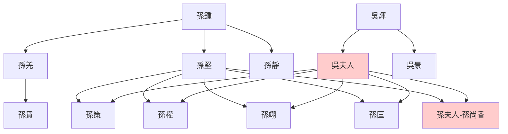

---
export_on_save:
  html: true
---

> 2022/1/14->2022/1/23

# 522 卷六十一 汉纪五十三

> 194->195

## 52201 騰遂謀誅李傕及二征陶謙
> 春，正月，辛酉，赦天下->柔舉宗從之

## 52202 陳宮張邈叛曹迎呂布
> 呂布之捨袁紹從張楊也->乃进攻之

## 52203 呂布曹操兗州之戰
> 五月，以扬武将军郭汜为后将军->操乃止

## 52204 劉璋繼任及陶謙讓徐州
> 十二月，司徒淳于嘉罢->日磾病其失节，呕血而死

## 52205 孫策寄身袁術
> 初，孙坚娶钱唐吴氏->与贲共将兵击英等
- 孫吳世系

## 52206 李郭樊內鬥及劫天子質公卿
> 春，正月，癸丑，赦天下->苞等因将所领兵归汜
- 郭汜妻怕他留戀李傕妻妾，偽造李傕下毒。再次宴請時，郭汜疑其有毒，和糞汁飲以解毒，關係破裂

## 52207 李傕拒和解
> 是日，傕复移乘舆境北坞->在三公之右

## 52208 定陶之戰及呂布投劉備
> 吕布将薛兰->外然之而内不悦
- 曹操在定陶之戰用空城計破呂布

## 52209 爭劫漢獻帝及軍閥亂鬥
> 李傕、郭汜相攻连月->大破之，斬首數千級

## 52210 獻帝流亡及沮授進策
> 於是董承等以新破傕等->绍不从
- 李郭之亂亂成一鍋粥，有兩點可見慘烈：侍者被殺，血濺伏皇后衣；士卒爭渡，斷指於舟中可掬。上一次手指可掬還要追溯回春秋邲之戰
- 獻帝睿智已於流亡中盡顯：接受臭牛骨忍而不發；絕不隨意下詔誣陷段煨；堅拒捨棄百官縱馬逃跑。淪落至此境地，仍能堅持原則有的放矢之帝王，恐亙古未有

## 52211 孫策破劉繇及團隊初成
> 初，丹杨朱治尝为孙坚校尉->繇从之

## 52212 笮融濫殺及臧洪死守
> 初，陶谦以笮融为下邳相->如何一日杀二烈士

## 52213 公孫瓚建易京
> 公孙瓚既杀刘虞->居于平阳
