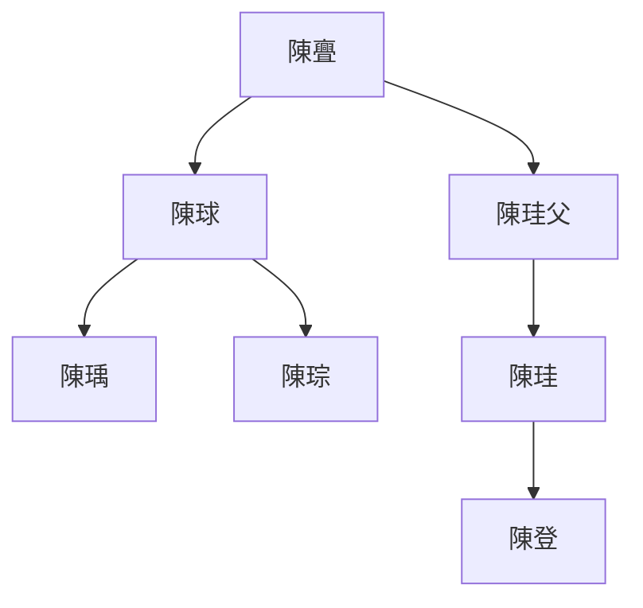
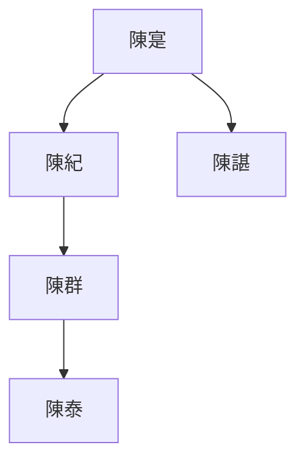

---
export_on_save:
  html: true
---

> 2022/1/24->2022/1/31

# 523 卷六十二 汉纪五十四

> 196->198

## 52301 徐州易主及獻帝還雒陽
> 春，正月，癸酉，大赦，改元->或为兵士所杀
- 稆：野生稻

## 52302 袁術欲稱帝
> 袁术以谶言“代汉者当涂高”->策遂与之绝

## 52303 曹操挾天子
> 曹操在许，谋迎天子->始立宗庙社稷于许

## 52304 孫策破王朗及曹操得謀士
> 孙策将取会稽->当事不当尔邪

## 52305 孔融破走曹操屯田轅門射戟
> 北海太守孔融->然後各罷
- 孔融死到臨頭還談笑自若，有另類大將之風

## 52306 劉備投曹操及張繡附劉表
> 備合兵得萬餘人->表乃止
- 蔡邕漢樂四品

名稱|用途
--|--
太予樂|典郊廟上陵殿舉之樂
周頌雅樂|典辟雍饗射六宗社稷之樂
黃門鼓吹|天子所以宴樂群臣
短簫鐃歌|軍樂

## 52307 禰衡死張繡叛及十勝十敗
> 平原禰衡->腾、遂各遣子入侍
- 十勝十敗：道義治度謀德仁明文武

## 52308 袁術稱帝及呂布破之
> 袁术称帝于寿春->布騎皆於水北大咍笑之而還

## 52309 陷陣營陳國破袁術衰釋楊彪
> 泰山賊帥臧霸襲琅邪相蕭建於莒->由是得免於禍
- 下邳陳氏世系

## 52310 李傕郭汜黨盡
> 馬日磾喪至京師->封閺鄉侯

## 52311 戰張繡及下邳之戰
> 初，袁绍每得诏书->陳登以功加伏波將軍
- 潁川陳氏世系

## 52312 孫策貢獻及收祖郎太史慈
> 劉表與袁紹深相結約->軍人以為榮

## 52313 太史慈然諾及易京危
> 會劉繇卒於豫章->瓚众日䠞
