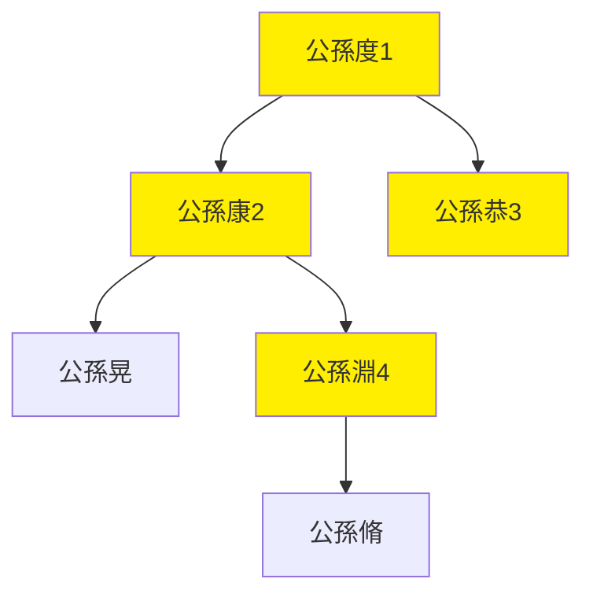

---
export_on_save:
  html: true
---

> 2022/2/9->2022/2/16

# 525 卷六十四 汉纪五十六

> 201->205

## 52501 劉備奔劉表及張遼收昌豨
> 春，三月，丁卯朔，日有食之->操遣豨还

## 52502 益州之亂及張魯治漢中
> 赵韪围刘璋于成都->鲁从之

## 52503 袁譚袁尚爭位及鍾繇定河東
> 春，正月，曹操军谯->南单于遂降
- 袁氏派系
  - 袁譚：辛評、郭圖、辛毗
  - 袁尚：逢紀、審配、李孚

## 52504 博望坡之戰及周瑜拒質曹
> 刘表使刘备北侵->遂不送質
- 博望坡之戰劉備難得出點戰績，演義里都被諸葛亮搶走

## 52505 轉攻劉表及二袁鬩墻
> 春，二月，曹操攻黎陽->谭、尚皆不从
- 廣為人知的可靠愚忠者管統，妻子被殺獨身來投袁譚，助之與其弟袁尚互毆。最佳擦屁股同事王修，兩次力保管統

## 52506 勸攻二袁及孫權出征
> 辛毘至西平见曹操->拜齐平东校尉

## 52507 鄴之戰
> 春，正月，曹操济河->稟食之

## 52508 殺許攸降高幹袁譚反
> 初，袁紹與曹操共起兵->略定诸县

## 52509 牽招使遼東及徐氏刺媯覽
> 曹操表公孙度为武威将军->统河部曲
- 遼東公孫世系

## 52510 斬袁譚收名士焦觸降張燕歸
> 春，正月，曹操攻南皮->封安國亭侯

## 52511 高幹反及杜畿平治河東
> 故安趙犢->常为天下最

## 52512 荀悅作申鑒
> 秘书监、侍中荀悦作申鉴五篇->而海内平矣
