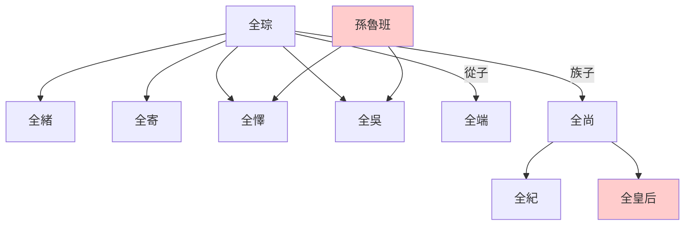
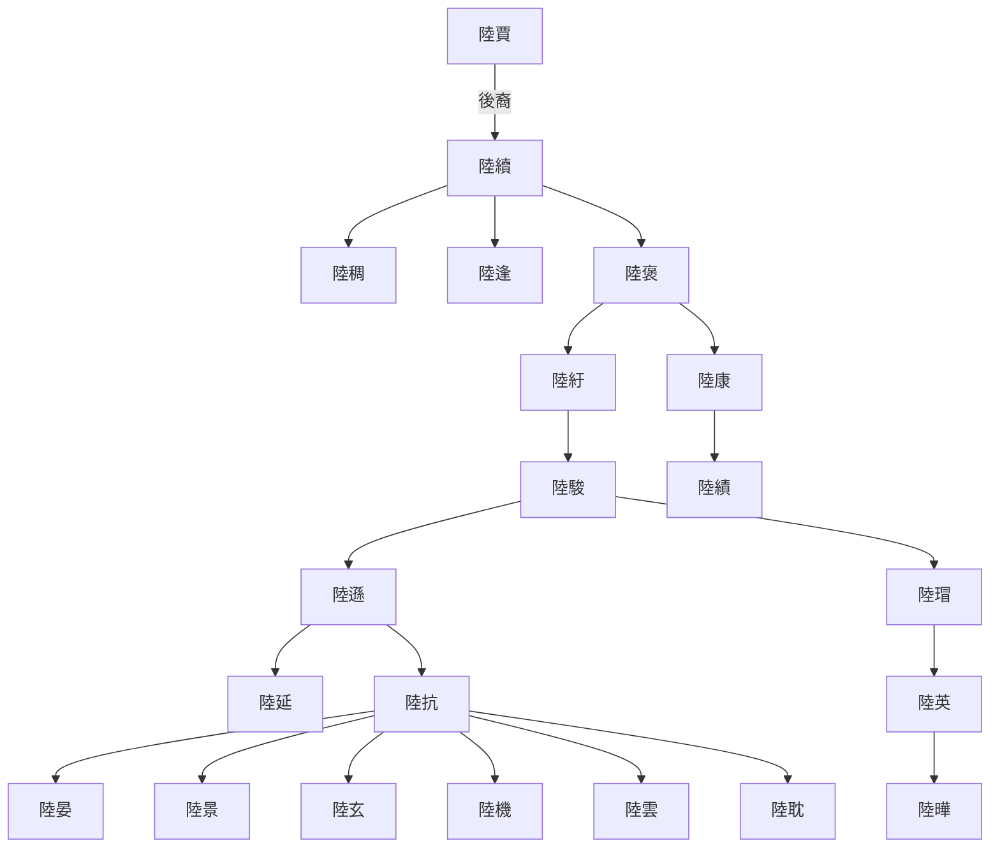

---
export_on_save:
  html: true
---

> 2022/6/29->2022/7/6

# 606 卷七十四 魏纪六

> 238->245

## 60601 魏滅燕之戰及劉禪立太子
> 春，正月，帝召司马懿于长安->殡敛于宅

## 60602 步練師死及誅呂壹
> 九月，吴改元赤乌->未知诸君于管子何如耳

## 60603 劉放孫資弄權
> 冬，十一月，壬午，以司空卫臻为司徒->乃疾驱入朝
- 催巴慣用名：漢為宜祿，魏為辟邪

## 60604 曹叡托孤及曹爽結黨
> 春，正月，懿至，入见->以征東將軍滿寵為太尉
- 漢昭帝看不上元帝，愛其子成帝而傳之，西漢滅亡；曹操看不上曹丕，愛其子曹叡而傳之，曹魏滅亡。隔代指定，亡國之事

## 60605 蔣琬寬厚呂岱平交周瑜後裔
> 夏，四月，吳督軍使者羊衜擊遼東守將->诏复以建寅之月为正

## 60606 吳魏芍陂之戰及孫登卒
> 春，旱->驻公安

## 60607 蔣琬水攻鄧艾屯田吳立二宮
> 汉大司马蒋琬以诸葛亮数出秦川->书三、四上，吴主不听

## 60608 吳不疑蜀及六代論
> 春，正月，帝加元服->爽不能用

## 60609 興勢之戰
> 春，正月，吴主以上大将军陆逊为丞相->乃听事终日而犹有不暇焉

## 60610 二宮之爭起
> 春，正月，以票骑将军赵俨为司空->吴主意乃稍解
- 全氏世系圖

- 吳郡陸氏世系圖

## 60611 董允死黃皓起
> 夏，六月，都乡穆侯赵俨卒->由祗阿意迎合而皓浸润构间故也
