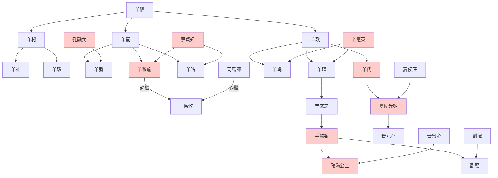
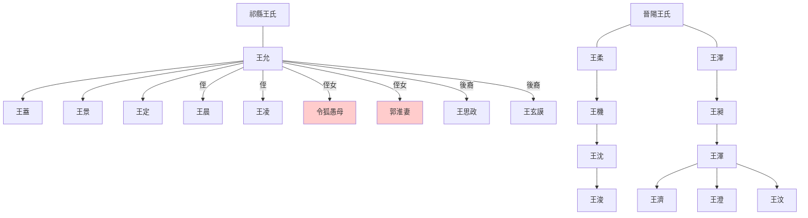

---
export_on_save:
  html: true
---

> 2022/7/7->2022/7/14

# 607 卷七十五 魏纪七

> 246->252

## 60701 平高句麗及費禕濫赦
> 春，二月，吴车骑将军朱然寇柤中->维讨平之

## 60702 譙周進諫及司馬懿稱疾
> 汉主数出游观->帝皆不听

## 60703 姜維二次北伐及曹爽驕奢
> 吴主大发众集建业->忍不可忍

- 姜維十一次北伐表

次數|年代|勝負|說明
--|--|--|--
1|240|撤退|姜維攻隴西，郭淮退之(通鑑無記載)
2|247|平|羌胡降漢，姜維與郭淮夏侯霸大戰洮西
3|248|平|姜維出兵石營，郭淮攻廖化(通鑑無記載)
4|249|敗|曲城之戰，姜維遁走，句安降
5|250|撤退|姜維復出西平，糧盡而退
6|253|撤退|姜維圍南安，與諸葛恪六戰合肥並進，郭淮、陳泰解圍，糧盡而退
7|254|勝|姜維出隴西狄道，徐質殺張嶷，復仇斬徐質
8|255|大勝|狄道之戰，姜維夏侯霸大破王經於洮西
9|256|大敗|段谷之戰，胡濟被鄧艾破，死傷慘重
10|257|平|趁諸葛誕叛亂出兵秦川，魏軍堅守不戰，後退兵
11|262|敗|被鄧艾破於侯和

## 60704 司馬懿裝病及管輅卜筮
> 冬，河南尹李胜出为荆州刺史->散骑常侍昭谋诛曹爽

## 60705 高平陵之變
> 春，正月，甲午，帝谒高平陵->与张当俱夷三族

## 60706 曹爽黨羽及玄學初興
> 初，爽之出也->丙午，大赦
- 古今逃婚第一人夏侯令女，逼婚一次割兩耳，再逼一次割鼻。然自毀身體是為不孝，可稱貞烈否？
- 何晏說：一級牛逼夏侯玄，二級牛逼司馬師，三級牛逼我只聞其聲，未見其人……沒錯，正是在下。高平陵之變，一級牛逼被免官，二級牛逼暗中籌劃，三級牛逼被夷三族。
- 太山羊氏世系

## 60707 夏侯霸奔蜀及朱然蔣濟死
> 丁未，以太傅懿为丞相->遂发病，丙子，卒

## 60708 麴城之戰王凌密謀徐邈清節
> 秋，汉卫将军姜维寇雍州->钦，毓之子也

## 60709 二宮之爭止
> 夏，五月，以征西将军郭淮为车骑将军->吴主立子亮为太子

## 60710 王昶破吳及王凌之亂
> 吴主遣军十万作堂邑涂塘以淹北道->不得与人交关
- 壽春三叛表

名稱|年代|發起者|平叛者|事件
--|--|--|--|--
王凌之亂|251|王凌|司馬懿|高平陵之變後，王凌欲廢曹芳立曹彪，被告密失敗，夷三族及開棺戳尸
毌丘儉文欽之亂|255|毌丘儉、文欽|司馬師|廢曹芳立曹髦後，毌丘儉文欽討伐司馬師，孫吳派兵支援，最終毌丘儉死，文欽、文鴛奔吳
諸葛誕之亂|257|諸葛誕|司馬昭|諸葛誕被賈充逼反，起兵對抗司馬昭，求援孫吳，最終諸葛誕死，殺文欽，文鴛降

- 太原王氏世系

## 60711 司馬懿死制南匈奴孫權後悔
> 秋，七月，壬戌，皇后甄氏殂->乃止

## 60712 托孤諸葛恪及縊殺潘皇后
> 吳主以太子亮幼少->坐死者六七人

## 60713 孫權卒及徙諸王
> 吴主病困->遂移南昌

## 60714 東興之戰
> 初，吴大帝筑东兴堤以遏巢湖->事辄不果
