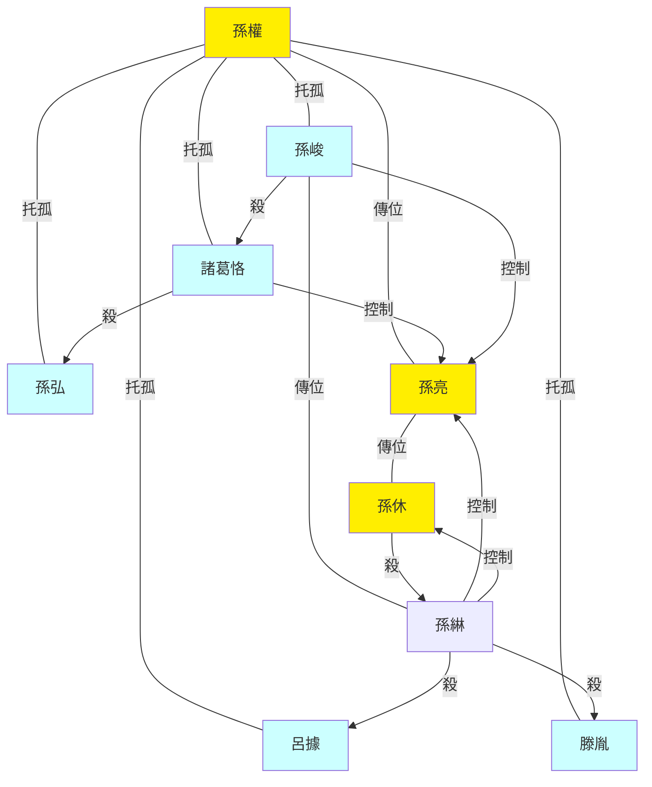
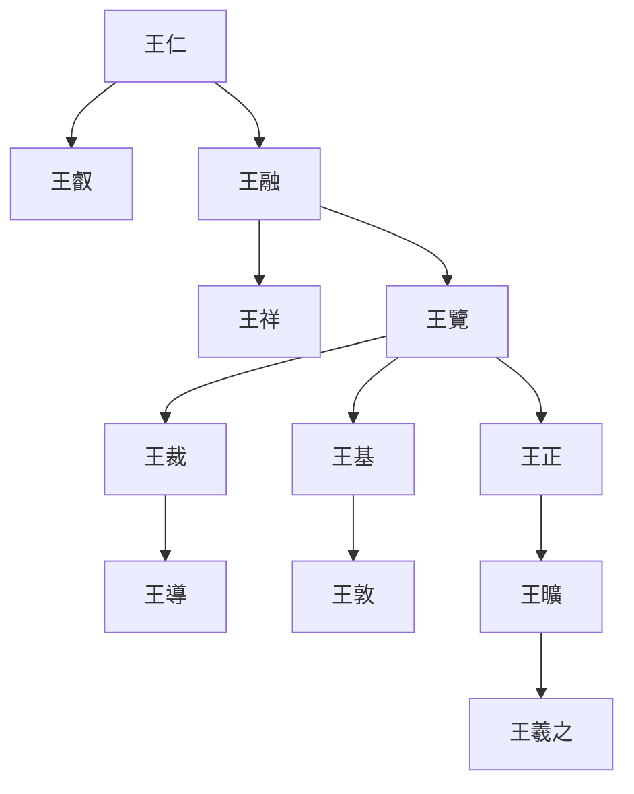
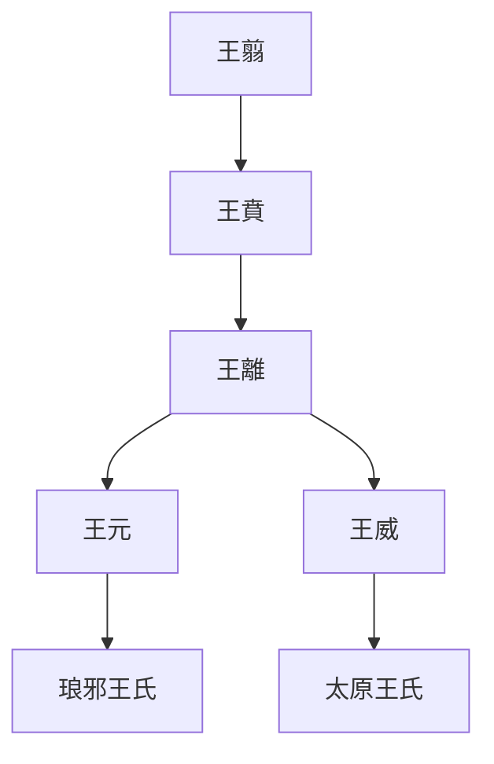

---
export_on_save:
  html: true
---

> 2022/7/22->2022/7/29

# 609 卷七十七 魏纪九

> 256->261

## 60901 曹髦論儒及段谷之戰
> 春，正月，汉姜维进位大将军->乃以卫将军行大将军事

## 60902 孫峻呂岱滕胤吕據死
> 八月，庚午，诏司马昭加号大都督->吾耻为叛臣。”遂自杀
- 孫權托孤亂政圖

## 60903 王祥至孝孫綝專政孫亮親政
> 以司空郑冲为司徒->左右莫不惊悚
- 琅邪王氏世系

- 琅邪太原王氏源流圖

## 60904 諸葛誕之亂起
> 征东大将军诸葛诞素与夏侯玄->端等封拜各有差
- 朱異堪稱天生打工人，一戰失敗，再戰失敗，三戰拒絕而被斬

## 60905 仇國論
> 汉姜维闻魏分关中兵以赴淮南->雖有智者将不能谋之矣
- 治世更迭用文王策，亂世更迭用漢祖策

## 60906 諸葛誕之亂平
> 春，正月，文钦谓诸葛诞曰->昭前後九讓，乃止

## 60907 孫綝廢孫亮立孫休
> 秋，七月，吳主封故齊王奮為章安侯->封永康侯

## 60908 孫休執政及除孫綝
> 先是，丹杨太守李衡数以事侵琅邪王->不可谓智。”遂寝

## 60909 罷守漢中及封晉公
> 初，汉昭烈留魏延镇汉中->封晋公，加九锡

## 60910 曹髦赴死及曹奐即位
> 帝见威权日去->以尚书右仆射王观为司空

## 60911 孫亮自殺及王沈治豫州
> 吴都尉严密建议作浦里塘->沈乃止

## 60912 孫吳詐降黃皓用事鮮卑入質
> 春，三月，襄阳太守胡烈表言->诸部皆畏服之