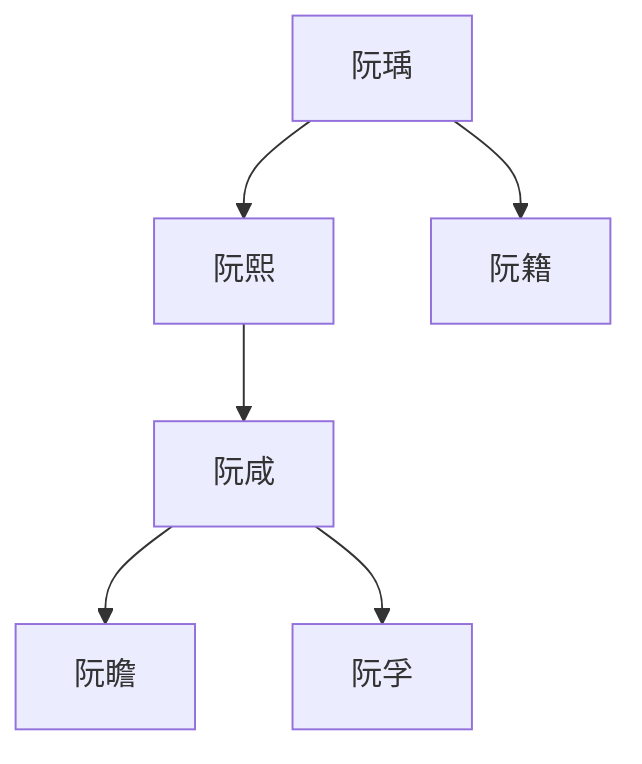
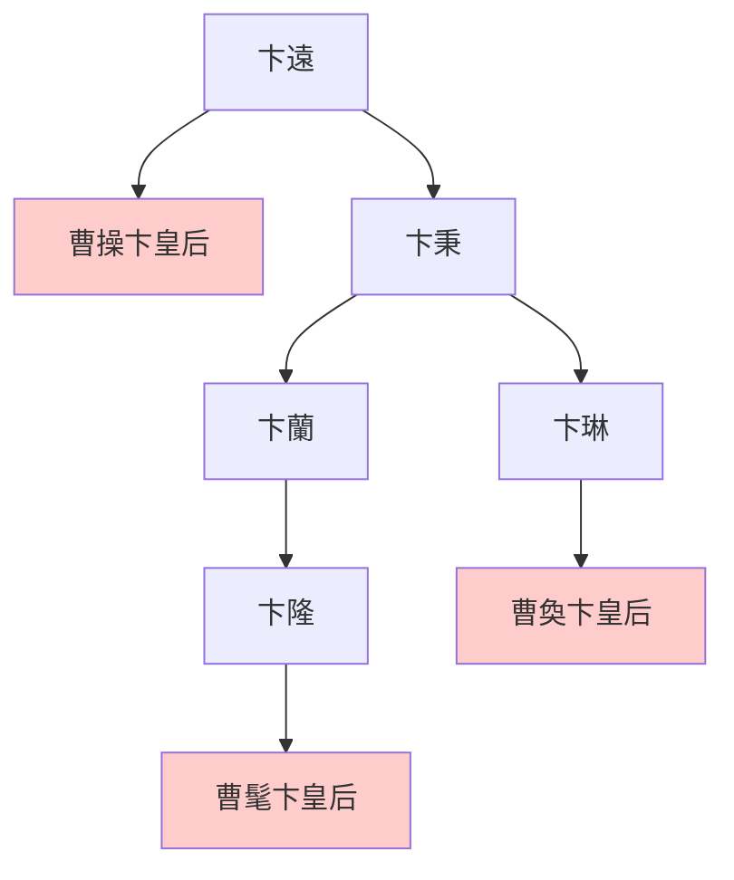

---
export_on_save:
  html: true
---

> 2022/7/30->2022/8/5

# 610 卷七十八 魏纪十

> 262->264

## 61001 姜維種麥及張布濮陽興貴寵
> 秋，八月，乙酉，吴主立皇后朱氏->不复使昭等入

## 61002 竹林七賢
> 谯郡嵇康->难乎免于今之世矣
- 陳留阮氏世系

- 呂巽字長悌，迷姦弟媳，為掩蓋過失告弟不孝，使其被誅

## 61003 魏滅蜀之戰及交趾之亂
> 司马昭患姜维数为寇->昭烈将军秉之孙也
- 蔣舒開創打工人被降薪後刪庫跑路的先河；與之形成對比的是，傅肜忠君愛國戰死，其子傅僉亦忠君愛國戰死。
- 三卞皇后圖

## 61004 偷渡陰平及劉禪降魏
> 邓艾进至阴平->至是乃服

## 61005 平五溪夷及鄧艾矜伐
> 吴人以武陵五溪夷与蜀接界->終不自嫌以損國家計也

## 61006 鍾會之亂
> 鍾會內有異志->与宴谈而遣之
- 收尸達人向雄，為王經、鍾會收尸兩次可全身而退

## 61007 永安之戰進爵晉王樂不思蜀
> 二月，丙辰，车驾还洛阳->太保郑冲总而裁焉

## 61008 孫休死改立孫皓及立司馬炎
> 吴分交州置广州->是岁，罢屯田官