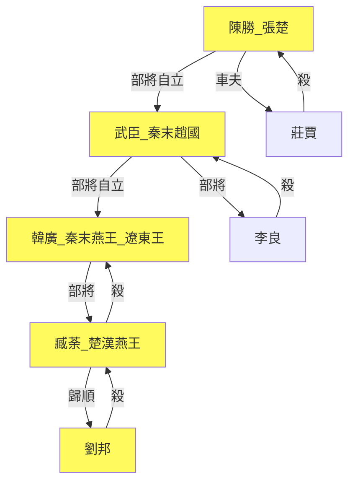

> 2021/1/7->2021/1/11

# 301 卷九 汉纪一

> -206->-205

## 30101 秦亡及约法三章
> 冬，十月，沛公至霸上->于是楚军夜击坑秦卒二十馀万人新安城南

- 歷代歲首表

朝代|岁首|理由
--|--|--
夏|十三月|寅为人正
商|十二月|丑为地正
周|十一月|子为天正
秦|十月|建亥之月水得位
汉初|十月|十月至霸上（降子婴）
汉武帝太初元年|一月|改用夏正

## 30102 鸿门宴
> 或说沛公曰->立诛杀曹无伤

- 樊噲勸劉邦不禍禍秦王室，鴻門宴一席話項羽接不上來，絕不是屠狗辈那麽簡單

## 30103 火燒阿房及十八諸侯
> 居数日->封十万户侯

- 秦末漢初政權逗逼分裂圖

## 30104 諸侯就國
> 汉王怒->又杀之

## 30105 韓信拜將
> 初，淮阴人韩信->给军粮食

## 30106 殺義帝及暗度陈仓
> 八月，汉王引兵从故道出，袭雍->置河内郡

- 王陵母已自殺，項羽還烹之，不環保

## 30107 陳平歸漢及彭城之戰
> 初，阳武人陈平->翟王翳亡降楚

- 刘邦逃命踹下去的鲁元公主和汉惠帝，开伦理学之巅峰。鲁元公主是汉惠帝的姐姐兼丈母娘，而刘肥遇到鲁元公可以叫干妈也可以叫妹妹。後代中山靖王一百多孩子，除了给刘备钻空子外不过尔尔，上通庶母中淫弟媳下奸三女的刘定国，才是大汉仁孝之标杆。

## 30108 漢軍滎陽
> 田横进攻田假->以取敖仓粟

## 30109 韓信下魏破代
> 周勃、灌婴等言于汉王曰->汉辄使人收其精兵诣荥阳以距楚

- 魏无知举例的尾生孝己这俩倒霉孩子，绝对都是成事不足成名有余的料，给陈平开脱完美
- 韩信怕周叔，怕李左车，高人无处不在，想要成大事的关键是能躲过高人
