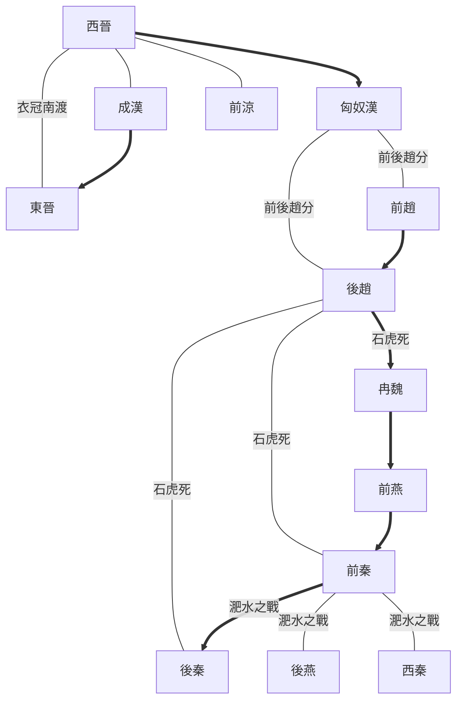

---
export_on_save:
  html: true
---

> 2023/8/5->2023/8/19

# 809 卷九十八 晋纪二十

> 348->350

## 80901 石宣殺石韜及石虎誅之
> 夏，四月，林邑寇九真->亦诛之
- 呵呵自古以來就是送命詞彙，虎毒可食子
- 石虎手刃重要家屬列表

姓名|關係|卒年|死因
--|--|--|--
郭夫人|結髪妻子||被鄭櫻桃挑撥毆打致死
崔夫人|第二任妻子||被鄭櫻桃挑撥殺死
劉皇后|嬸|333|石勒皇后，不滿石虎起兵被誅
石弘|堂弟|335|石虎篡位殺之
石邃|長子|337|太子，欲篡位被殺，合葬全家26人一口棺材內
石宣|次子|348|太子，殺石韜被虐燒殺圍觀，株連全家
柳貴嬪|妾|348|被石虎殺

## 80902 封賞桓溫慕容皝卒趙立太子
> 朝廷论平蜀之功->义不敢拜也

## 80903 石虎稱帝及姚弋仲平梁犢
> 春，正月，辛未朔，大赦->诛三千馀家

## 80904 平范賁石虎卒及劉后弄權
> 夏，四月，益州刺史周抚->以为己副

## 80905 石遵奪位石沖起兵罷黜蒲洪
> 彭城王遵至河内->遣使来降

## 80906 前燕備伐後趙
> 燕平狄将军慕容霸上书于燕王俊曰->號太祖

## 80907 褚裒北伐不利
> 桓溫聞趙亂->复还梁州

## 80908 冉閔弒石遵及石鑒即位
> 初，赵主遵之发李城也->侍中卢谌为中书监

## 80909 蒲洪自立及謀誅閔農及殺胡令
> 秦、雍流民相帅西归->拜为中尉
- 晉朝淝水之戰前北方中原權力裂變
  - 西晉滅亡：[匈奴漢]劉淵攻[西晉]，劉聰滅[西晉]
  - 前後趙分：劉聰死，裂變出[前趙]劉曜、[後趙]石勒
  - 後趙滅前趙：石勒滅[前趙]劉曜，傳石虎
  - 石虎暴政：石虎死，裂變出[冉魏]冉閔、[前秦]前身苻洪、[後秦]前身姚弋仲
  - 冉魏篡後趙：冉閔頒佈殺胡令，篡[後趙]稱帝
  - 前燕滅冉魏：冉閔攻殺後趙殘餘，[前燕]慕容儁滅[冉魏]冉閔
  - 前秦滅前燕：慕容恪死後，苻堅滅[前燕]慕容暐
  - 淝水之戰：[東晉]謝安敗[前秦]苻堅，裂變出[後燕]慕容垂、[後秦]姚萇，以及各國蠢動如[西秦]、[北魏]等

- 淝水之戰前政權形勢圖

## 80910 改趙為衛及後趙滅冉魏立
> 春，正月，赵大将军闵欲灭去石氏之迹->国号大魏

## 80911 殷浩北伐苻洪稱王前燕拔薊
> 朝廷闻中原大乱->俊引兵還薊

## 80912 鴆苻洪石祗立殺李農段齊立
> 魏主闵复姓冉氏->代郡民於凡城

## 80913 苻健入長安及襄國之戰
> 王朗之去長安也->下诏免谟为庶人