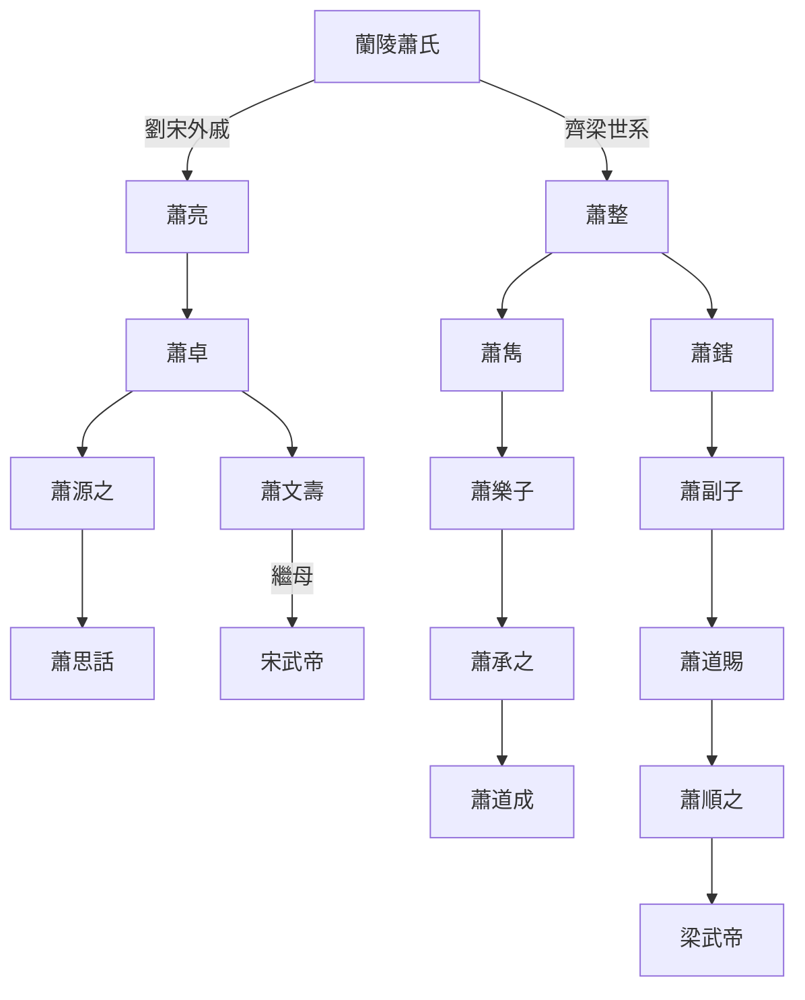

---
export_on_save:
  html: true
---

> 2024/12/31->2025/1/19

# 904 卷一百二十二 宋纪四

> 431->435

## 90401 胡夏滅西秦及檀道濟唱籌量沙
> 春，正月，壬午朔，燕大赦，改元大興->思話坐徴，繋尚方

## 90402 王慧龍農戰並脩及胡夏滅亡
> 燕王立夫人慕容氏为王后->封西秦王

## 90403 北魏修內政
> 左仆射临川王义庆固求解职->交州兵击却之

## 90404 吐谷渾無賞及北魏攻北燕
> 春，正月，丙午，魏主尊保太后窦氏为皇太后->太子詹事劉湛為領軍將軍
- 漁陽在北魏分化出密雲，主要為丁零人

## 90405 司馬飛龍之亂及北燕拒降
> 益州刺史劉道濟->不如守志更圖也

## 90406 程道養稱蜀王
> 魏主之圍和龍也->应募者日有千馀人

## 90407 謝弘微持家及李順使北涼
> 初，晋谢混尚晋陵公主->蒙逊荒淫猜虐，群下苦之
- 親戚挪用家產賭博而謝弘微不問，還是謝家錢太多了，雖博得一時名聲，敗落也自此而始

## 90408 陸俟預判高車及劉道濟死
> 春，正月，乙卯，魏主遣永昌王健督诸军救辽西->法护，法崇之兄也

## 90409 沮渠蒙遜死及仇池得漢中
> 凉王蒙逊病甚->魏宁朔将军卢玄来聘

## 90410 誅謝靈運及劉宋復漢中
> 前秘书监谢灵运->萧思话徙镇南郑
- 從謝靈運到李白，本質皆為恃才放逸的無用之人，與戲子明星並無二致，甚至全社會都被裹挾，為一兩人浪費資源，對真正的國計民生毫無益處。只有盛唐時期，才能讓李白流傳些談資，宋文帝雖稱元嘉之治，但比不上盛唐，謝靈運就因攪擾百姓終被處死
- 蘭陵蕭氏世系圖

## 90411 于什門歸北燕首鼠魏平山胡
> 甲戌，赫连昌叛魏西走->故未之遣

## 90412 劉湛反咬萬國朝魏北燕危蹙
> 領軍將軍劉湛與僕射殷景仁素善->使镇童亭