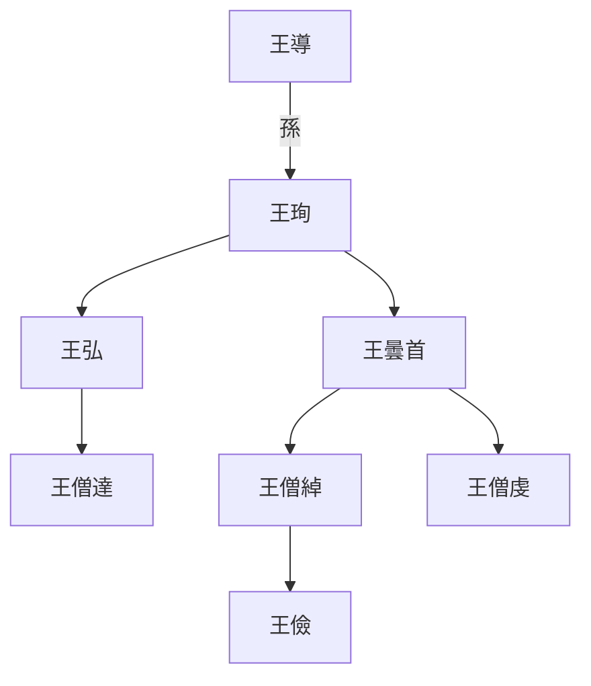

---
export_on_save:
  html: true
---

> 2026/1/8->2026/1/24

# 1001 卷一百三十五 齐纪一

> 479->483

## 100101 宋順帝禪位蕭道成
> 春，正月，甲辰，以江州刺史蕭嶷為都督荊、湘等八州諸軍事->別更詳議

## 100102 蕭道成新政
> 以褚淵為司徒->五月，辛亥，詔斷衆募

## 100103 殺宋順帝屠宗室撫交州
> 壬子，上強佐命之功->以廣香爲沙州刺史

## 100104 王玄邈破李烏奴
> 八月，乙亥，魏主如方山->立皇太子妃裴氏

## 100105 第一次齊魏戰爭及垣崇祖克敵
> 癸丑，魏遣假梁郡王嘉督二將出淮陰->謝天蓋部曲殺天蓋以降

## 100106 北魏數道並進
> 宋自孝建以來->同入寇

## 100107 周盤龍父子萬人敵
> 淮北四州民不樂屬魏->至肆州
- 上湯殺囚：以洗澡治病名義蒸殺。與納粹浴室滅絕法遙相呼應
- 周盤龍父子首創循環自殺激勵流派，謊報兒子死了父親進去猛殺，兒子出來又說父親死了又進去猛殺

## 100108 法秀之亂及車僧朗遇刺
> 沙門法秀以妖術惑衆->約共伐魏

## 100109 平司馬朗之及薛虎子屯田
> 魏尉元、薛虎子克五固->立馬儒為王

## 100110 蕭道成死齊武帝立
> 春，正月，壬戌，詔置學生二百人->以國哀罷國子學

## 100111 李崇治荊兗及永明之治
> 氐王楊文弘卒->皆命以禮改葬
- 永明之治
    - 追尊亡妻為皇后
    - 恢復公務員工資，之前因戰爭停發
    - 兄弟蕭嶷不參朝政，但多聽其諫
    - 拉攏小國仇池、宕昌、鄧至
    - 確立官員三年任期制(小滿)
    - 拒絕禳除天象災變
    - 改葬刺殺其父被打倒的忠臣

## 100112 齊武帝舊怨殺荀伯玉垣崇祖
> 上之為太子也->皆收殺之

## 100113 殺張敬兒齊魏通使
> 庚子，魏主如崞山->普慶慚懼而起
- 王儉相關世系

- 馮太后男寵
    - 李弈：顏值高被寵幸，被養子魏獻文帝殺，馮太后最終毒死魏獻文帝
    - 王叡：顏值偉光正被寵幸，親身退虎，病死
    - 李沖：工作能力強被寵幸，參與改革推行三長制
    - 劉纘：南齊派遣使者，42歲被寵幸，維護和平

- 張敬兒原名張苟兒，因爲母親夢見狗。弟弟張恭兒原名張豬兒。父親張丑。