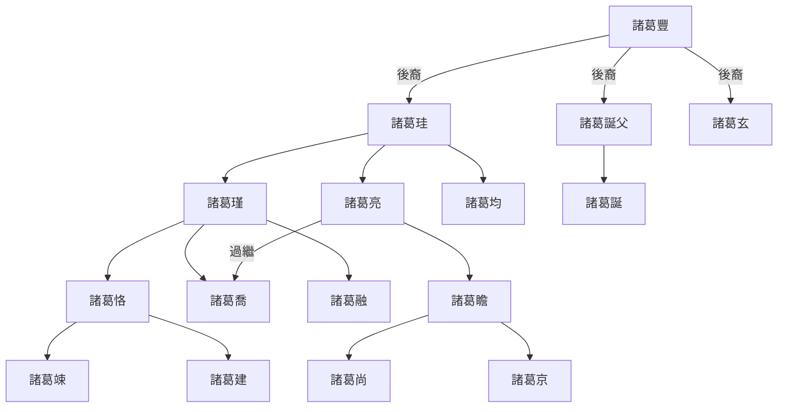

---
export_on_save:
  html: true
---

> 2022/7/15->2022/7/21

# 608 卷七十六 魏纪八

> 253->255

## 60801 費禕遇刺及二司馬引咎
> 春，正月，朔，蜀大将军费祎与诸将大会于汉寿->況於再乎

## 60802 諸葛恪輕敵拒諫
> 光祿大夫張緝言於師曰->夏，四月，大赦

## 60803 合肥新城之戰及姜維六次北伐
> 漢姜維自以練西方風俗->怨讟兴矣

## 60804 孫峻刺殺諸葛恪
> 汝南太守邓艾言于司马师曰->恪果以此败
- 琅邪諸葛世系

## 60805 孫峻殺孫和及李豐謀反
> 吴群臣共议上奏->不克，皆死

## 60806 廢曹芳立曹髦
> 帝以李豐之死->漢兵乃還
- 王莽使王舜取王政君璽綬，王政君摔璽；司馬師使郭芝取郭太后，威言而意折。歷史重演時，流氓會更加流氓，老實人會越來越㞞。
- 曹髦即位有虛文浮禮而無雷霆手段，空持漢文帝的劇本而無所施展

## 60807 毌丘儉文欽之亂
> 初，揚州刺史文欽->以雍州刺史陳泰代之

## 60808 文鴦陷陣及尹大目徒勞
> 吳丞相峻率驃騎將軍呂據->仍著于律令
- 衣帶詔事件，董貴人懷孕而死；誅毌丘儉事，毌丘芝因懷孕倖免

## 60809 司馬師死及孫儀刺孫峻
> 舞阳忠武侯司马师疾笃->功卒不成

## 60810 狄道之戰
> 汉姜维复议出军->尊大帝为太祖
- 狄道之戰，姜維派出新降將領夏侯霸，另一將張翼反對其黷武，卻被派上戰場，足見蜀中無人，姜維窮兵