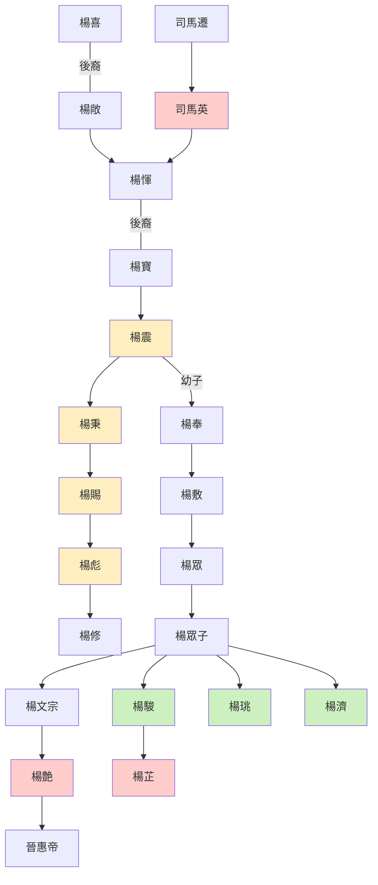

---
export_on_save:
  html: true
---

> 2022/9/25->2022/10/2

# 703 卷八十一 晋纪三

> 280->288

## 70301 晉滅吳之戰
> 春，正月，吴大赦->帝善之
- 以火燒斷鐵索為滅吳的關鍵，也是不符合科學的疑點

## 70302 王渾王濬爭功
> 王濬之入建业也->然后见之
- 王濬：夫犯上干主，其罪可救；乖忤贵臣，祸在不测。

## 70303 置十九州及去州郡兵
> 杜预还襄阳->此萬世之長策也。帝不聽

## 70304 羊車望幸慕容始寇愷崇鬥富
> 春，三月，诏选孙皓宫人五千人入宫->无有穷极矣
- 弘農楊氏名人世系

- 周昌言劉邦為桀紂，劉毅言司馬炎為桓靈

## 70305 張華罷黜及賈充死
> 尚书张华->广陆成侯李胤薨
- 惡謚達人秦秀，謚何曾為繆醜公，謚賈充為荒公，均不納

## 70306 司馬攸歸齊及憤恚而卒
> 齐王攸德望日隆->必择言而后发

## 70307 議廢九品中正制
> 夏，五月，己亥，琅邪武王伷薨->帝虽善其言而终不能改也

## 70308 王濟不屈慕容廆起扶餘復國
> 冬，十二月，庚午，大赦->地震