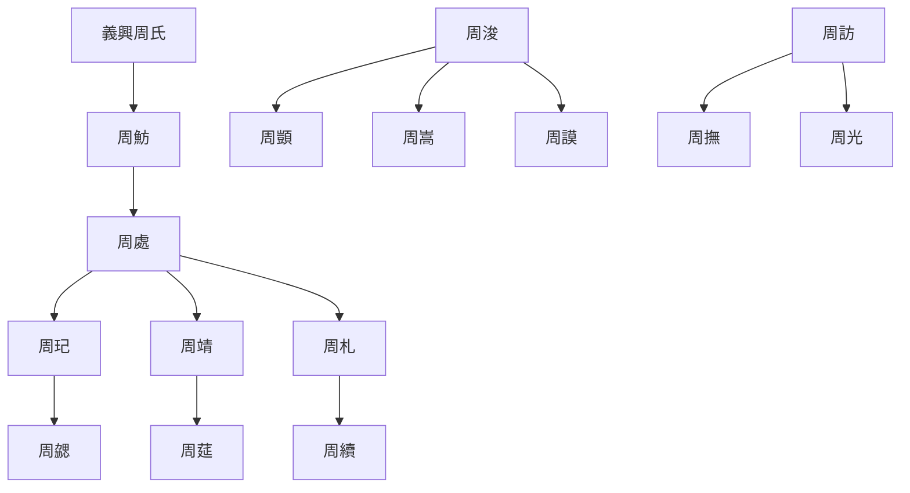

---
export_on_save:
  html: true
---

> 2023/4/28->2023/5/9

# 803 卷九十二 晋纪十四

> 322->323

## 80301 王敦之亂
> 春，正月，郭璞复上疏->遂绝之

## 80302 司馬承起兵及甘卓猶豫
> 敦遣参军桓罴说谯王承->卓不能从

## 80303 楊難敵稱藩及陳安稱涼王
> 二月，甲午，封皇子昱为琅邪王->封酒泉王

## 80304 王敦克建康
> 帝征戴渊、刘隗入卫建康->官至太子太傅而卒

## 80305 王敦掌權及伯仁死
> 帝令公卿百官诣石头见敦->负此良友

## 80306 王敦遙控及殺司馬承甘卓
> 沈充拔吴国->識者咸知其將敗焉

## 80307 後趙反攻及晉元帝死
> 秋，七月，後趙中山公虎拔泰山->葬元帝于建平陵

## 80308 王遜冠裂及交州定陳安死
> 三月，戊寅朔，改元->封平襄公
- 王遜冠裂而卒，就是傳說中的氣炸了

## 80309 殺曹嶷及張茂臣劉曜
> 帝畏王敦之逼->加九錫

## 80310 仇池敗成漢及劉曜不廢立
> 楊難敵聞陳安死->命熙於胤盡家人之禮

## 80311 張茂修臺允之佯醉周氏強盛
> 張茂大城姑臧->士民颇信事之
- 兩晉諸周氏世系

