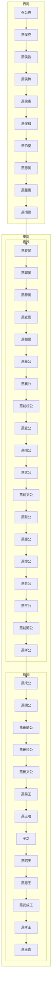
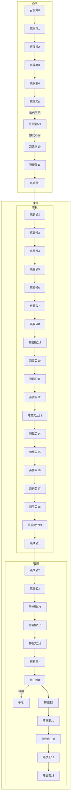

# 燕國世系圖

## 傳位圖

```mermaid
graph TB

subgraph 西周
    召公奭-->燕侯克
    燕侯克-->燕侯旨
    燕侯旨-->燕侯舞
    燕侯舞-->燕侯憲
    燕侯憲-->燕侯和
    燕侯和-->燕伯聖
    燕伯聖-->燕惠侯
    燕惠侯-->燕釐侯
    燕釐侯-->燕頃侯
end

subgraph 東周
    subgraph 春秋
        燕頃侯-->燕哀侯
        燕哀侯-->燕鄭侯
        燕鄭侯-->燕穆侯
        燕穆侯-->燕宣侯
        燕宣侯-->燕桓侯
        燕桓侯-->燕莊公
        燕莊公-->燕襄公
        燕襄公-->燕前桓公
        燕前桓公-->燕宣公
        燕宣公-->燕昭公
        燕昭公-->燕武公
        燕武公-->燕前文公
        燕前文公-->燕懿公
        燕懿公-->燕惠公
        燕惠公-->燕悼公
        燕悼公-->燕共公
        燕共公-->燕平公
        燕平公-->燕前簡公
        燕前簡公-->燕孝公
    end
    subgraph 戰國
        燕孝公-->燕成公
        燕成公-->燕閔公
        燕閔公-->燕後簡公
        燕後簡公-->燕後桓公
        燕後桓公-->燕後文公
        燕後文公-->燕易王
        燕易王-->燕王噲
        燕王噲-->子之
        子之-->燕昭王
        燕昭王-->燕惠王
        燕惠王-->燕武成王
        燕武成王-->燕孝王
        燕孝王-->燕王喜
    end
end

```

## 關系圖

```mermaid
graph TB

subgraph 西周
    召公奭0-->燕侯克1
    燕侯克1-->燕侯旨2
    燕侯旨2-->燕侯舞3
    燕侯舞3-->燕侯憲4
    燕侯憲4-->燕侯和5
    燕侯和5--數代不明-->燕伯聖6-9
    燕伯聖6-9--數代不明-->燕惠侯10
    燕惠侯10-->燕釐侯11
    燕釐侯11-->燕頃侯1
end

subgraph 東周
    subgraph 春秋
        燕頃侯1-->燕哀侯2
        燕哀侯2-->燕鄭侯3
        燕鄭侯3-->燕穆侯4
        燕穆侯4-->燕宣侯5
        燕宣侯5-->燕桓侯6
        燕桓侯6-->燕莊公7
        燕莊公7-->燕襄公8
        燕襄公8-->燕前桓公9
        燕前桓公9-->燕宣公10
        燕宣公10-->燕昭公11
        燕昭公11-->燕武公12
        燕武公12-->燕前文公13
        燕前文公13-->燕懿公14
        燕懿公14-->燕惠公15
        燕惠公15-->燕悼公16
        燕悼公16-->燕共公17
        燕共公17-->燕平公18
        燕平公18-->燕前簡公19
        燕前簡公19-->燕孝公1
    end
    subgraph 戰國
        燕孝公1-->燕成公2
        燕成公2-->燕閔公3
        燕閔公3-->燕後簡公4
        燕後簡公4-->燕後桓公5
        燕後桓公5-->燕後文公6
        燕後文公6-->燕易王7
        燕易王7-->燕王噲8
        燕王噲8--禪讓-->子之!
        燕王噲8-->燕昭王9
        燕昭王9-->燕惠王10
        燕惠王10-->燕武成王11
        燕武成王11-->燕孝王12
        燕孝王12-->燕王喜13
    end
end

```
