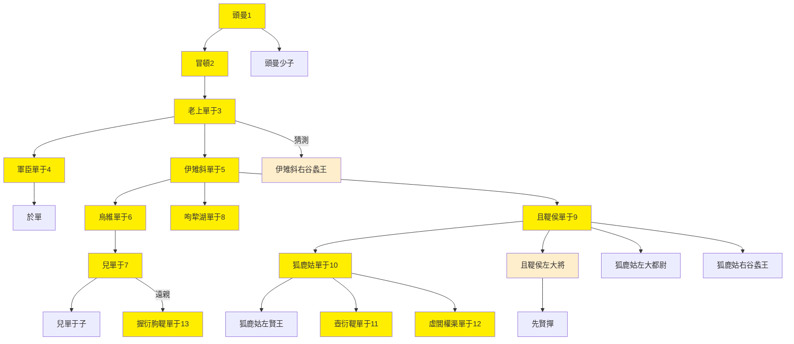

# 匈奴世系圖

## 關系圖

```mermaid
graph TB

頭曼1-->冒頓2
頭曼1-->頭曼少子
冒頓2-->老上單于3
老上單于3-->軍臣單于4
軍臣單于4-->於單
老上單于3-->伊雉斜單于5
老上單于3--猜測-->伊雉斜右谷蠡王
伊雉斜單于5-->烏維單于6
烏維單于6-->兒單于7
兒單于7-->兒單于子
伊雉斜單于5-->呴犂湖單于8
伊雉斜單于5-->且鞮侯單于9
且鞮侯單于9-->狐鹿姑單于10
且鞮侯單于9-->且鞮侯左大將
且鞮侯單于9-->狐鹿姑左大都尉
且鞮侯單于9-->狐鹿姑右谷蠡王
且鞮侯左大將-->先賢撣
狐鹿姑單于10-->狐鹿姑左賢王
狐鹿姑單于10-->壺衍鞮單于11
狐鹿姑單于10-->虛閭權渠單于12
兒單于7--遠親-->握衍朐鞮單于13

classDef chanyu fill:#ffee00
class 頭曼1,冒頓2,老上單于3,軍臣單于4,伊雉斜單于5,烏維單于6,兒單于7,呴犂湖單于8,且鞮侯單于9,狐鹿姑單于10,壺衍鞮單于11,虛閭權渠單于12,握衍朐鞮單于13 chanyu

classDef nearchanyu fill:#ffeecc
class 伊雉斜右谷蠡王,且鞮侯左大將 nearchanyu

```
