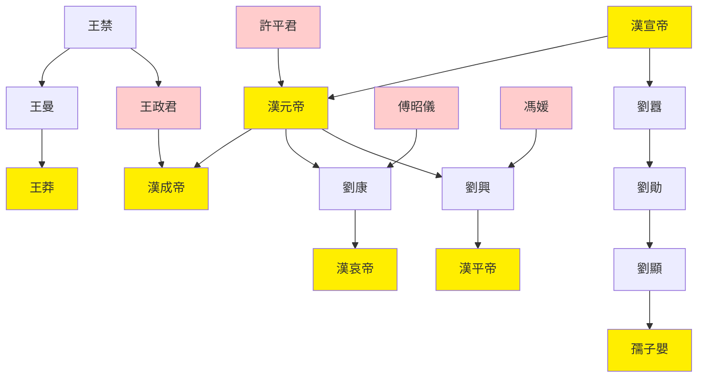
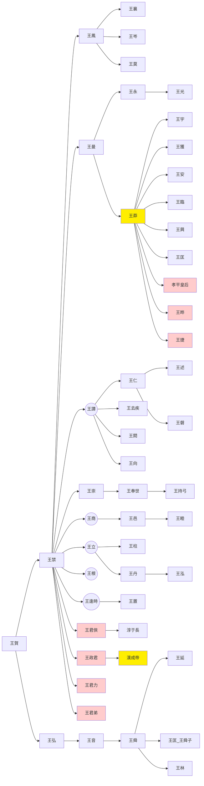

# 漢元王莽世系圖

## 漢元帝世系

```mermaid
graph TB

許平君-->漢元帝
漢宣帝-->漢元帝
王禁-->王曼
王曼-->王莽
王禁-->王政君
漢元帝-->漢成帝
王政君-->漢成帝
漢元帝-->劉康
傅昭儀-->劉康
劉康-->漢哀帝
漢元帝-->劉興
馮媛-->劉興
劉興-->漢平帝
漢宣帝-->劉囂
劉囂-->劉勛
劉勛-->劉顯
劉顯-->孺子嬰

classDef king fill:#ffee00
class 漢宣帝,漢元帝,漢成帝,漢哀帝,漢平帝,孺子嬰,王莽 king
classDef female fill:#ffcccc
class 許平君,王政君,傅昭儀,馮媛 female

```

## 王莽世系

```mermaid
graph LR

王賀-->王禁
王賀-->王弘

王禁-->王鳳
王禁-->王曼
王禁-->王譚((王譚))
王禁-->王崇
王禁-->王商((王商))
王禁-->王立((王立))
王禁-->王根((王根))
王禁-->王逢時((王逢時))
王禁-->王君俠
王禁-->王政君
王禁-->王君力
王禁-->王君弟

王鳳-->王襄
王鳳-->王岑
王鳳-->王莫

王曼-->王永
王永-->王光
王曼-->王莽
王莽-->王宇
王莽-->王獲
王莽-->王安
王莽-->王臨
王莽-->王興
王莽-->王匡
王莽-->孝平皇后
王莽-->王晔
王莽-->王捷

王譚-->王仁
王仁-->王述
王仁-->王磐
王譚-->王去疾
王譚-->王閎
王譚-->王向

王崇-->王奉世
王奉世-->王持弓

王商-->王邑
王邑-->王睦

王立-->王柱
王立-->王丹
王丹-->王泓

王逢時-->王置

王君俠-->淳于長

王政君-->漢成帝

王弘-->王音
王音-->王舜
王舜-->王延
王舜-->王匡_王舜子
王舜-->王林

classDef king fill:#ffee00
class 漢成帝,漢哀帝,漢平帝,孺子嬰,王莽 king
classDef female fill:#ffcccc
class 王君俠,王政君,王君力,王君弟,孝平皇后,王晔,王捷 female
```
