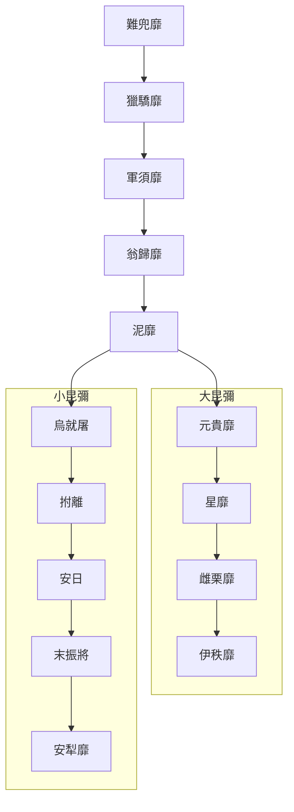
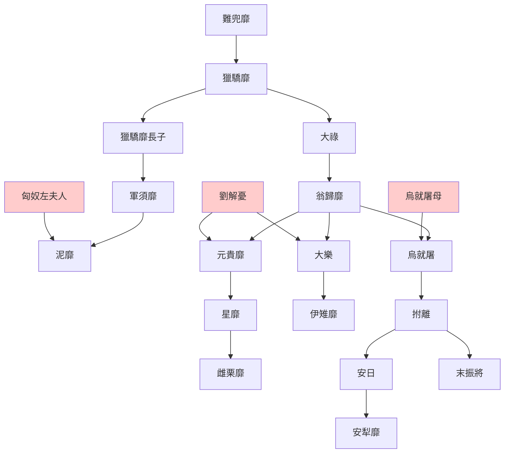
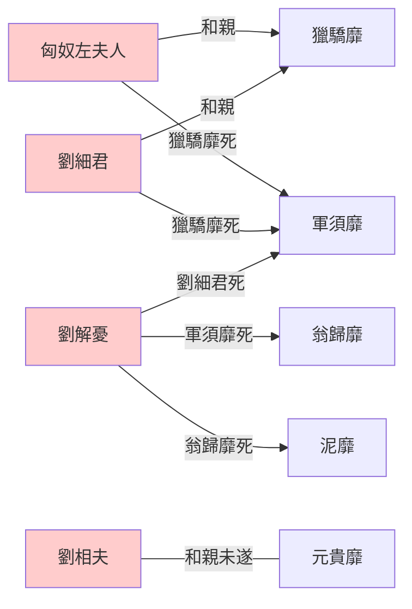

# 烏孫世系圖

## 傳位圖

```mermaid
graph TB
難兜靡-->獵驕靡
獵驕靡-->軍須靡
軍須靡-->翁歸靡
翁歸靡-->泥靡
泥靡-->元貴靡
泥靡-->烏就屠

subgraph 大昆彌
    元貴靡-->星靡
    星靡-->雌栗靡
    雌栗靡-->伊秩靡
end

subgraph 小昆彌
    烏就屠-->拊離
    拊離-->安日
    安日-->末振將
    末振將-->安犁靡
end
```

## 關系圖

```mermaid
graph TB

難兜靡-->獵驕靡

獵驕靡-->獵驕靡長子
獵驕靡-->大祿

獵驕靡長子-->軍須靡
軍須靡-->泥靡
匈奴左夫人-->泥靡

大祿-->翁歸靡
翁歸靡-->元貴靡
劉解憂-->元貴靡
元貴靡-->星靡
星靡-->雌栗靡
翁歸靡-->大樂
劉解憂-->大樂
大樂-->伊雉靡

翁歸靡-->烏就屠
烏就屠母-->烏就屠
烏就屠-->拊離
拊離-->安日
拊離-->末振將
安日-->安犁靡

classDef female fill:#ffcccc
class 匈奴左夫人,劉解憂,烏就屠母 female
```

## 夫妻關系圖

```mermaid
graph LR
匈奴左夫人--和親-->獵驕靡
匈奴左夫人--獵驕靡死-->軍須靡

劉細君--和親-->獵驕靡
劉細君--獵驕靡死-->軍須靡

劉解憂--劉細君死-->軍須靡
劉解憂--軍須靡死-->翁歸靡
劉解憂--翁歸靡死-->泥靡

劉相夫--和親未遂---元貴靡

classDef female fill:#ffcccc
class 匈奴左夫人,劉細君,劉解憂,劉相夫 female
```
