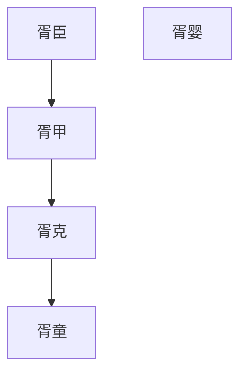
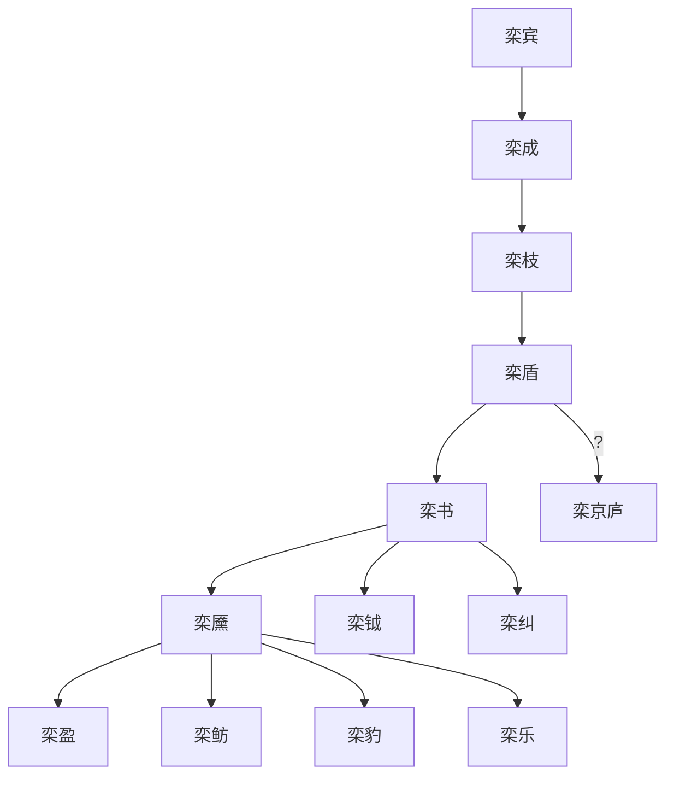
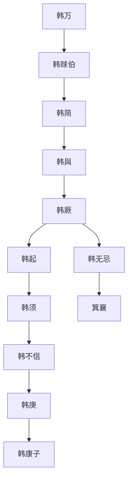
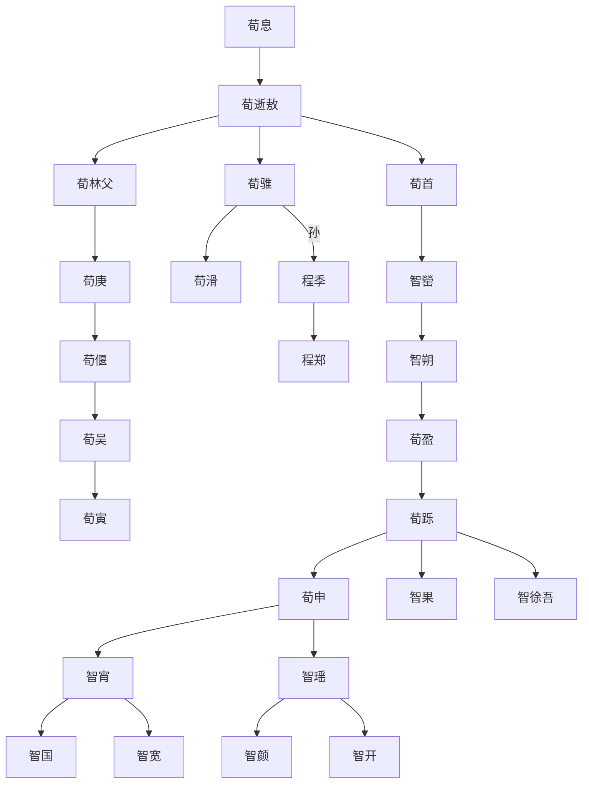
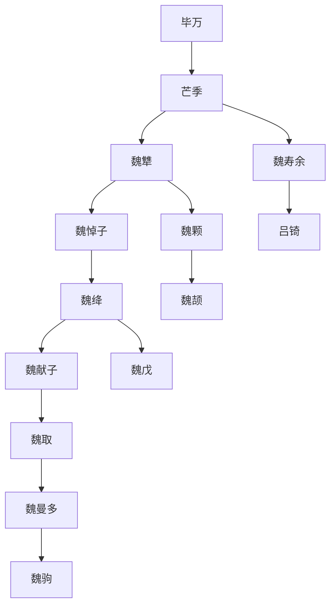
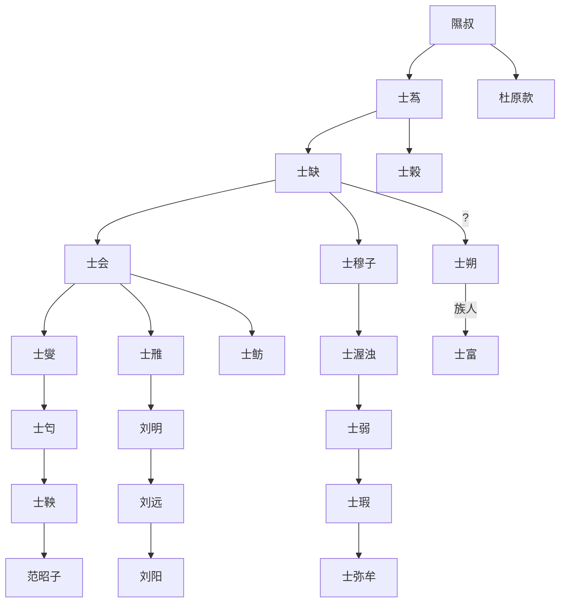
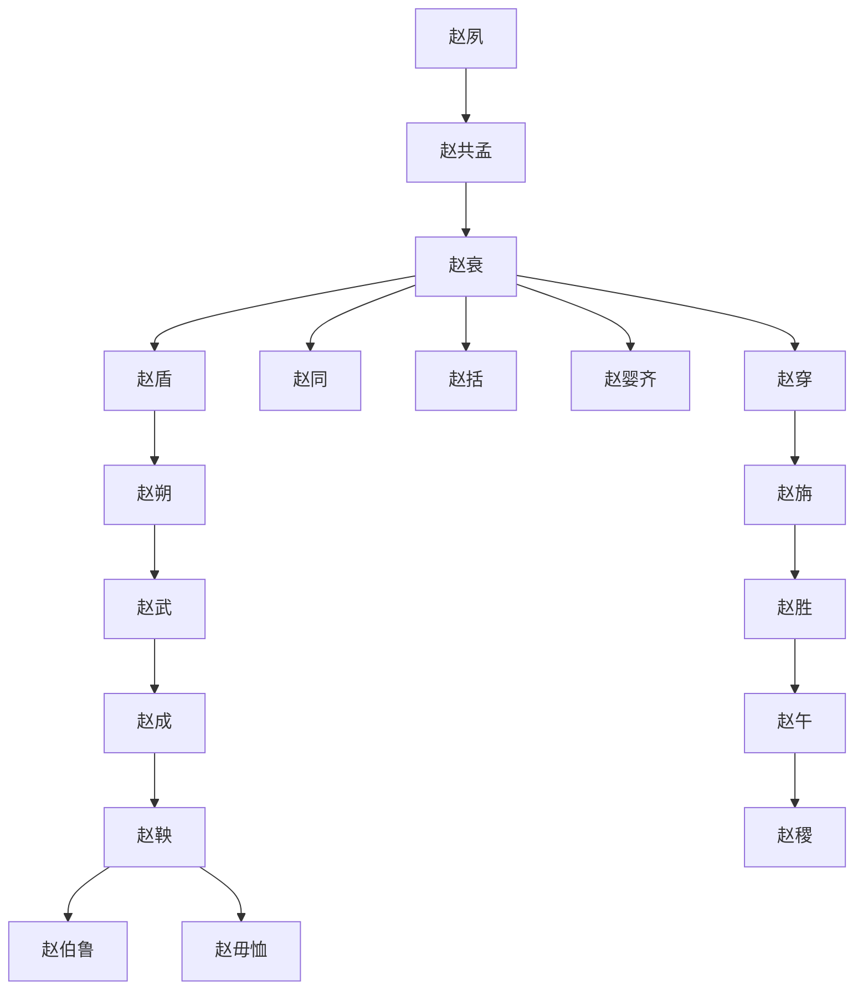

## 晋国三军六卿
- 概念：BC633年，被庐之蒐，晋文公建立的三军将佐制度。
- 分类：中军将、中军佐、上军将、上军佐、下军将、下军佐。中军将为正卿。
- 特点：六卿世袭，出将入相，长逝次补。
- 沿革：三军六卿制度两度扩充与恢复，至BC550年栾氏之乱后，六卿归于六大家族。BC493铁之战，灭范氏、中行氏，为四卿。BC453晋阳之战，灭智氏，为韩赵魏三家分晋。

### 十一世族
- 十一世族把持晋国六卿，分别为：狐氏、先氏、郤氏、胥氏、栾氏、范氏、中行氏、智氏、韩氏、赵氏、魏氏。

#### 晋国历代将佐表

狐氏|先氏|郤氏|胥氏|栾氏|韩氏|中行氏|智氏|魏氏|范氏|赵氏
--|--|--|--|--|--|--|--|--|--|--
狐毛|先轸|郤榖|胥臣|栾枝|韩厥|荀林父|荀首|魏相|范会|赵衰
狐偃|先且居|郤溱|胥婴|栾盾|韩穿|荀庚|智罃|魏颉|范燮|赵盾
狐射姑|先都|郤缺|胥甲|栾书|韩起|中行偃|智盈|魏绛|范朔|赵朔
||先蔑|郤克|胥克|栾黡|韩须|中行吴|智跞|魏舒|范匄|赵同
||先克|郤锜||栾盈|韩不信|中行寅|智申|魏取|范鲂|赵括
||先榖|郤至|||韩庚||智瑶|魏侈|范鞅|赵旃
|||郤犨|||韩虎|||魏驹|范吉射|赵武
|||||||||||赵成
|||||||||||赵鞅
|||||||||||赵无恤

- 其他卿士：臾骈、箕郑父、屠击
- 荀氏别族：荀骓、程郑

#### 狐氏
- 狐射姑与赵盾因立太子产生分歧，逃离晋国
- 衍生贾氏
- 简略族谱

#### 先氏
- 多为武官
- 先榖勾结犬戎作乱，被晋公驱逐
- 衍生原氏
- 简略族谱

#### 郤氏
- 三郤锜犨至，被晋厉公及胥童灭族
- 衍生冀氏、步氏、温氏、苦成氏
- 简略族谱

#### 胥氏
- 胥童灭三郤，后被栾书、中行偃灭
- 简略族谱

#### 栾氏
- 栾氏之乱，栾盈被六卿联手击败
- 衍生卞氏
- 简略族谱

#### 韩氏
- 衍生箕氏、蔺氏
- 简略族谱

#### 中行氏、智氏
- 荀息假途伐虢
- 范吉射与中行寅攻打晋定公，被国人赶走
- 智瑶败于晋阳之战，被三家分智
- 源出荀氏、原氏，荀林父为中行氏，荀骓为程氏，荀首为智氏。
- 智氏衍生辅氏、涂氏。
- 简略族谱
 

#### 魏氏
- 豫让出于毕氏
- 源出毕氏。衍生令狐氏、吕氏
- 简略族谱

#### 范氏
- 源出被灭杜国公子，来晋为士师，掌刑法
- 源出杜氏、士氏，衍生范氏、随氏、巩氏、彘氏、刘氏
- 士雃是刘邦祖先
- 范吉射与中行寅攻打晋定公，被国人赶走
- 简略族谱

#### 赵氏
- 衍生梁氏、原氏、屏氏、楼氏、邯郸氏
- 简略族谱

