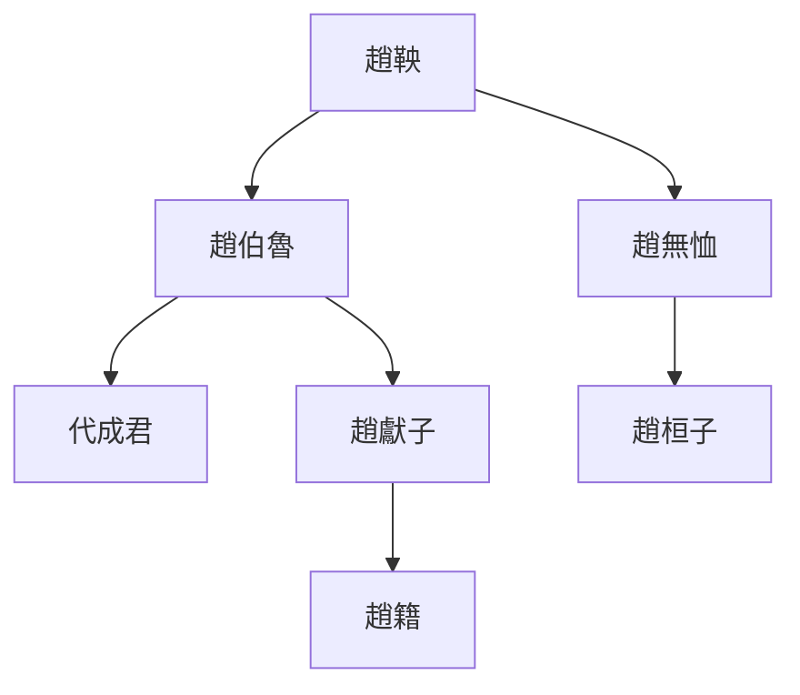
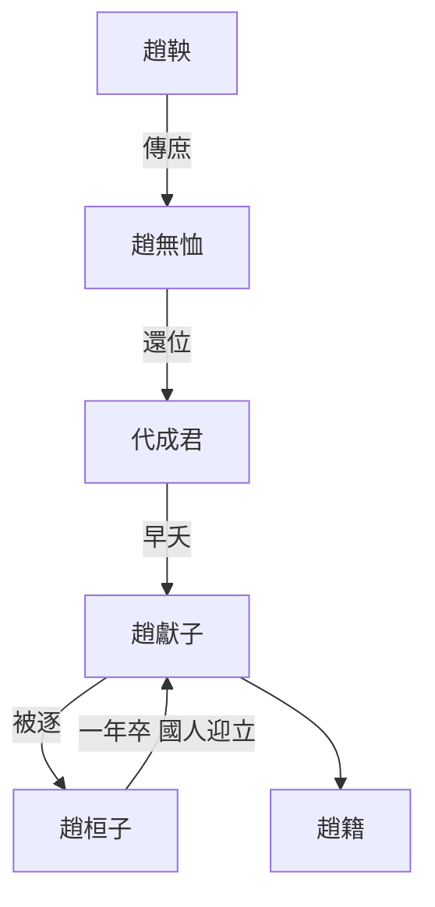
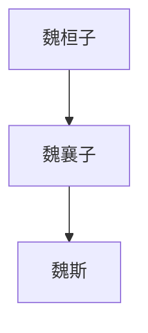
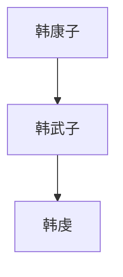
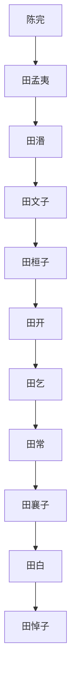
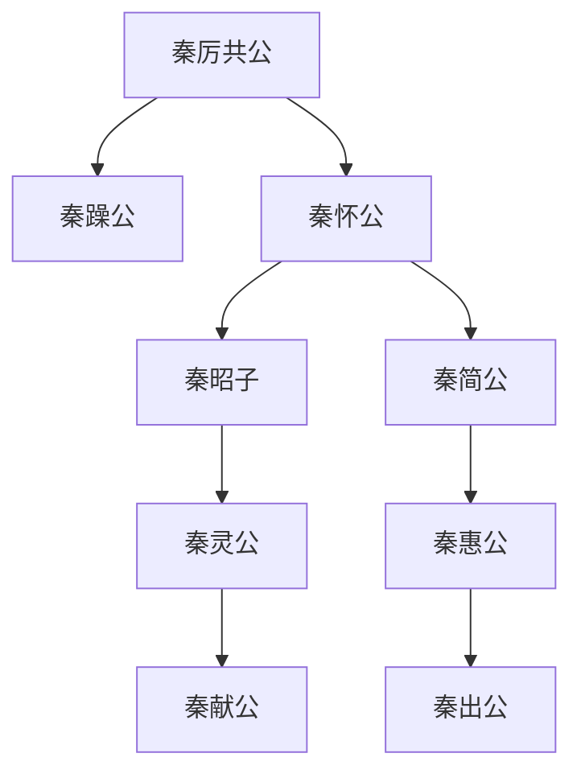
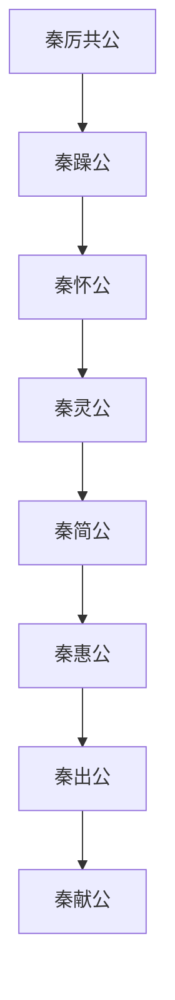

> 2020/7/7->2020/7/30

# 101 卷一 周纪一

> -403->-369

## 10101 三家分晋
> 初命晋大夫魏斯->岂不哀哉
- 威烈王23：三家分晋，魏赵韩开国国君
    - 魏斯
    - 赵籍
    - 韩虔
- 天下苟有桓、文之君，必奉礼义而征之。
    - 桓文之君没那么多，征之也未必能胜。三家分晋不是周天子的锅。

## 10102 三家滅智
> 初，智宣子将以瑶为后->又何失人之足患哉
- 德才论
    - 才：聪察强毅
    - 德：正直中和
    - 德御才
    
圣人|愚人|君子|小人
--|--|--|--
才德全尽|才德兼亡|德胜才|才胜德

## 10103 豫让复仇
> 三家分智氏之田->遂杀之

- 不要學豫讓，對昏君愚忠，和明主死磕。

## 10104 趙魏韩身世
> 襄子为伯鲁之不立也->是为景侯
- 趙建國前世系圖

- 赵建國前傳位圖

- 魏建國前传位图

- 韓建國前传位图

## 10105 魏文侯
> 魏文侯以卜子夏->愿卒为弟子

- 李悝观人五法：
    - 居视其所亲，富视其所与，达视其所举，穷视其所不为，贫视其所不取。

## 10106 吴起
> 吴起者，卫人->是以哭之
- 吴起擅长情感剥削，唯有当事人生母能识破
- 吴起师事曾申非曾申，通鉴bug

## 10107 至安王五年
> 燕湣公薨->日有食之
- 燕湣公与燕後简公更迭时间不符，舍通鉴

## 10108 聂政
> 三月，盗杀韩相侠累->遂死于政尸之旁
- 聂嫈为通鉴首位登场女性历史人物

## 10109 至安王十五年
> 郑驷子阳之党弑繻公->取南郑

- 田氏代齊前傳位圖

- 晉烈公與晉孝公更迭時間不符，舍通鑒

## 10110 魏武侯及吳起去魏
> 魏文侯薨->而楚之贵戚大臣多怨吴起者

- 魏文侯与魏武侯更迭时间不符，舍通鉴

## 10111 至安王二十五年
> 秦惠公薨->取兹方

- 吴起辅谁谁强，终为知己者死。
- 秦四代亂政世系圖

- 秦四代亂政傳位圖

- 四代乱政
    - 秦躁公薨，魏文侯送秦怀公回国抢位
    - 秦怀公被庶长鼌逼迫自杀
    - 秦灵公薨，魏文侯送秦简公回国赶走秦献公
    - 秦庶长政变，杀秦出公，改立秦献公

- 安王十七年，執宋公，不明是誰
- 安王十八年，齊太公薨，未提及齊廢公
- 齊桓公与齊威王更迭时间不符，舍通鉴
- 晉孝公与晉靜公更迭时间不符，舍通鉴

## 10112 子思仕衛
> 子思言苟变于卫侯曰->抑亦似君之君臣乎

## 10113 至烈王六年
> 鲁穆公薨->魏败赵师于怀

- 魯穆公与魯共公更迭时间不符，舍通鉴
- 衛慎公与衛聲公更迭时间不符，舍通鉴
- 韓哀侯与韓共侯更迭时间不符，舍通鉴

## 10114 齊威王
> 齐威王召即墨大夫->是为显王

## 10115 韓趙謀魏
> 魏大夫王错出奔韩->其国可破也

- 韓趙不和，魏惠王僥倖得國，從此迷信概率事件，比如魏國再來一個吳起就牛逼了這種。
