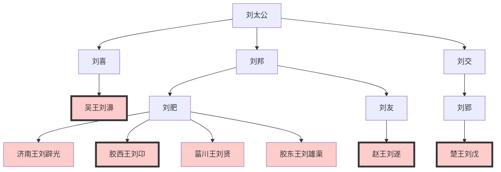
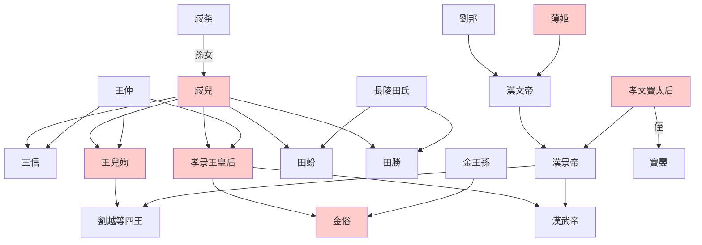

> 2021/3/1->2021/3/9

# 308 卷十六 汉纪八

> -154->-141

## 30801 博局斗殴及议削藩
> 冬，十月，梁王来朝->削其六县
- 察见渊鱼者不祥，智料隐匿者有殃，这话适合用来劝别人管不着
- 汉徭役类型

类型|释义
--|--
践更|自行为卒，轮到可以自己出钱雇人代替
居更|
过更|轮到者出钱三百入官，官雇人代替

## 30802 七国之乱起
> 廷臣方议削吴->梁王城守睢阳

## 30803 腰斩晁错
> 初，文帝且崩->吾亦恨之

- 晁错无解决问题能力：平乱让景帝冲在前面；以公报袁盎私仇；看事情闹大竟然反要给吴国土地。而发现问题，早在贾谊时已发现了。晁错只是和下棋斗殴的景帝性格相投，都是急脾气不计后果。

## 30804 七国之乱平
> 袁盎、刘通至吴->王遂自杀
- 路中大夫为国牺牲，而国君齐孝王首鼠两端自杀，标准愚忠致死。

## 30805 七国之乱後
> 帝以齐首善->王江北
- 七国之乱世系图

## 30806 改立刘彻
> 春，正月，作阳陵邑->立胶东王彻为皇太子
- 栗姬拒绝皇帝他姐安排的亲事，皇帝病中让他帮忙照顾妃子反骂皇帝是老狗，占着太子和二三子而失宠，最终被废，前无古人的作死。
- 漢景帝改元
  - 第一次：廢劉榮改立劉徹
  - 第二次：梁孝王劉武死
- 臧兒田竇世系圖

## 30807 郅都执法及刺杀袁盎
> 是岁，以太僕劉舍為御史大夫->擢为鲁相
- 汉景帝妃贾姬厕所遇野猪，郅都不救；辕固生尊儒抑道被窦太后投野猪圈，胜之。景帝时野猪泛滥，所以武帝小名彘好养活。元帝时始有冯婕妤挡熊。
- 宋国套娃让贤：宋宣公不传位给其子宋殇公，传给了弟弟宋穆公。宋穆公不传位给其子宋庄公，还位给侄子宋殇公。其后华督杀死宋殇公，迎立了宋庄公。
- 刘武杀袁盎，韩安国大哭、邹阳王信求情、田叔销毁证据、茅兰使匿刘嫖处，终于让窦太后松了口气。国无郅都，法治社会彻底沦陷。

## 30808 双标封侯及梁孝王死
> 冬，十一月，罢诸侯御史大夫官->他物称是
- 汉诸侯王朝见天子四见，共二十日
  - 小见：始到，燕见于禁门内，饮于省中
  - 法见：到正月朔旦，奉皮荐璧玉贺正月
  - 後三日，为王置酒，赐金钱财物
  - 後二日，复入小见，辞去

## 30809 李广斗匈奴
> 上既减笞法->李广乃归其大军

## 30810 周亚夫饿死
> 秋，七月，辛亥晦->欧血而死
- 古人污蔑套装：受金、盗嫂。陈平、直不疑皆中，没嫂子都中
- 樊哙剑盾切生猪肩而扬名，周亚夫不吃大胾而饿死，都是粗人，智商有别。

## 30811 汉景帝崩
> 是岁，济阴哀王不识薨->财力耗矣
- 刚建国的时候穷，主席都凑不齐四辆同款轿车，领导人有的还骑自行车，百姓更是一穷二白。从吕后到文景七十多年的休养生息，让国家和人民都富起来了，街上的车也多起来了。开个日本车都不好意思和人打招呼，看门老大爷每天大鱼大肉，富二代已经开始创业了。正因为有钱，没人愿意触碰法律的底线，法律也逐渐宽松，少数资本家则开始兼并，形成垄断。因此成功的官僚资本家开始炫富，无法无天，物盛而衰的变化从此开始。到了汉武帝时，国家极尽享乐之风，对外强硬扩张，致使国内外政局动荡不安，国力也逐渐耗费殆尽。
