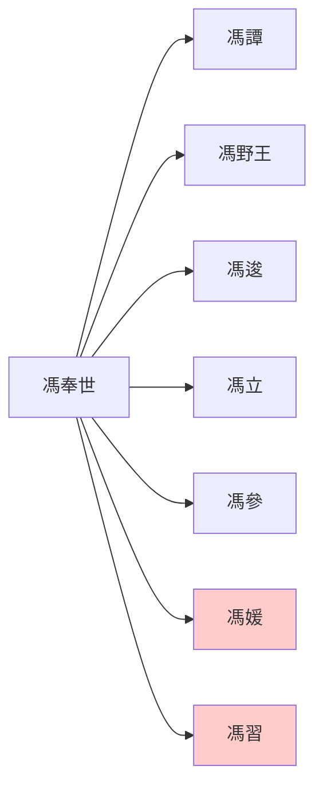

> 2021/6/22->2021/6/26

# 324 卷三十二 汉纪二十四

> -13->-8

## 32401 劉立禽獸行不治
> 春，正月，上行幸甘泉，郊泰畤->天子由是寝而不治
- 觀漢宗室所為，不乏禽獸行，谷永多嘴為親者諱，不是有貓膩，就是谷永實在太愛管閒事了

## 32402 谷永劉向論災變
> 是岁，司隶校尉蜀郡何武为京兆尹->上辄入之，然终不能用也

## 32403 漢成帝聽張禹不疑王根
> 红阳侯立举陈咸方正->遂親就禹
- 漢成帝師張禹與大司馬王根上演將相和，王氏位穩，終篡漢。晁錯斬而漢室安，漢家亡而張禹存

## 32404 朱雲折檻
> 故槐里令朱雲上書求見->以旌直臣
- 漢成帝、辛慶忌、朱雲、張禹、王氏均知漢衰，只有朱雲選擇折檻直諫，其餘人躺平而已，大勢已去

## 32405 安輯烏孫
> 匈奴搜谐单于将入朝->终羁縻不绝
- 漢瘋狂干涉烏孫內政，致其亡國，遠比月氏武力滅族兇殘

## 32406 漢哀帝定嗣
> 春，正月，丙寅，蜀郡岷山崩->何武为御史大夫
- 馮奉世世系

## 32407 建三公及夏侯藩索地
> 初，诏求殷后->不令当匈奴
- 夏侯藩的故事，含瘋狂暗示、找人當槍、緩兵之計、推諉、暗諷、翻舊賬、甩鍋、撈人一系列典型中國特色操作。大部分人通常會像夏侯藩一樣出力並背鍋，埋頭苦幹者死不了也活不太好

## 32408 淳于長誅
> 冬，十月，甲寅，王根病免->咸自知废锢，以忧死
- 孝成許皇后癡，以為還有故劍情深的基礎，實際早已是長門怨的節奏，終被賜死。左皇后神似山寨匈奴稱呼，聽著就不靠譜
- 孝成許皇后，被兩姐妹坑；兩個許皇后，均被淳于害死

## 32409 翟方進大清洗及王莽當權
> 方进智能有馀->其飾名如此
- 王氏五大司馬：鳳商音根莽
- 自獨尊儒術起，蕭望之開腐儒之風，五鹿充宗開佞儒之風，翟方進開儒棍之風

## 32410 古罄出而劉向諫興禮樂
> 丞相方進、大司空武奏言->后十三岁而王氏代汉
