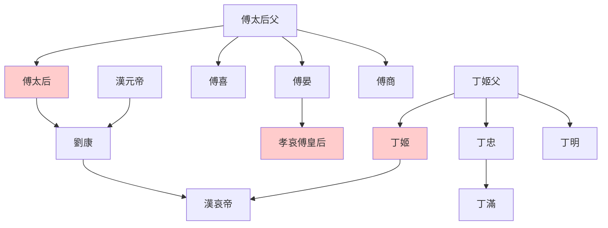

> 2021/6/26->2021/6/30

# 325 卷三十三 汉纪二十五

> -7->-6

## 32501 移禍翟方進而漢成帝崩
> 春，正月，上行幸甘泉，郊泰畤->仁之贼也
- 漢成帝之死拉仨墊背：翟方進為其擋天災而自殺，然並卵；死在趙合德床上，牡丹花下死又有牡丹花陪葬；遠方男寵張放哭泣而死，堪稱還淚佳話

## 32502 漢哀帝即位及傅太后求尊
> 皇太后诏南、北郊长安如故->太后乃复令莽视事
- 傅丁太后世系

## 32503 罷樂府官及限田限奴
> 成帝之世，郑声尤甚->益吏三百石以下俸
- 漢哀帝改革作為新官上任三把火的典型，傳承至今

## 32504 傅太后退王莽傅喜
> 上置酒未央宮->故尋復進用焉

## 32505 退王根及地震治河
> 建平侯杜業上書詆曲陽侯根->此最下策也
- 上中下三策套路：上策，完美主義，怎麼實現我不管；中策，實際方案；下策，誰都知道或根本不管的方案。話術包裝而已

## 32506 師丹進言及平反陳湯
> 孔光、何武奏->天子还汤，卒于长安

## 32507 漢成帝趙昭儀殺子事發
> 春，正月，陨石于北地十六->故太皇太后及王氏皆怨之
- 趙飛燕既間接促成漢哀帝即位，又直接與傅太后聯手，故漢哀帝不治其殺子反人類罪。耿育聲稱漢成帝為讓哀帝順利即位，所以殺子，必是傅太后或趙飛燕派系人物，或漢哀帝的官方發言人

## 32508 免師丹
> 丁酉，光禄大夫傅喜为大司马->以博為大司空

## 32509 馮媛誣死
> 中山王箕子->史立迁中太仆
- 馮婕妤因擋熊而成名，因被神經病張由瘋狗一般誣陷而死，命犯禽獸