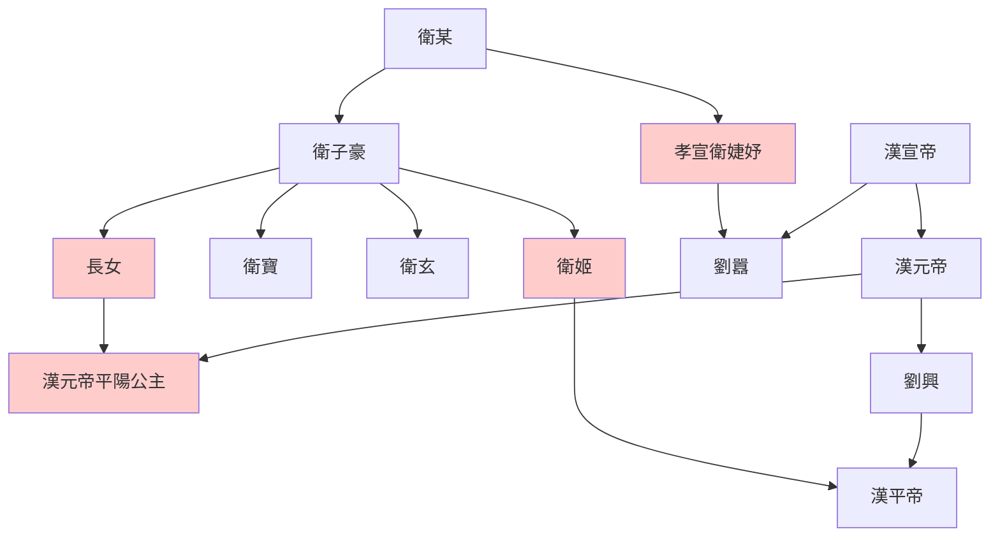

> 2021/7/4->2021/7/8

# 327 卷三十五 汉纪二十七

> -2->2

## 32701 王嘉言董賢及杜鄴言外戚
> 春，正月，辛丑朔->何嫌不报

## 32702 傅太后崩及百官黜陟
> 上又征孔光诣公车->拜鲍宣为司隶
- 傅太后名號多如狗

## 32703 王嘉嘔血
> 上托傅太后遗诏->册免明，使就第
- 馮媛知冤而自殺；王嘉知冤拒絕自殺，絕食嘔血而死。王嘉死而其策被用，足見漢哀帝也是頭腦混亂，宣帝後均呈現智商不足現象

## 32704 董氏權勢侔主及王閎力拒禪讓
> 冬，十一月，壬午->亦不罪也
- 禪讓從來只危國，燕得子之之亂，漢得王莽篡權

## 32705 匈奴怪董賢及漢哀帝崩
> 春，正月，匈奴单于及乌孙大昆弥伊秩靡皆来朝->汉业由是遂衰
- 烏珠留尬問董賢，後無侵邊之動，可見漢匈兩衰
- 新三公分職

名稱|原名|職責
--|--|--
大司馬|太尉|掌兵事
大司徒|丞相|掌人民事
大司空|御史大夫|掌水土事

## 32706 王莽復出大清算
> 太皇太后闻帝崩->皆此类也
- 王政君收璽綬，王莽殺異己，折騰倆月，共迎九歲小孩即位，早無意匡扶漢室
- 欒布哭彭越而成名，朱詡收董賢屍而被殺

## 32707 漢平帝即位
> 于是附顺莽者拔擢->葬孝哀皇帝于义陵

## 32708 王莽收买人心
> 春，正月，王莽风益州->权与人主侔矣

## 32709 衛氏留中山及群臣同聲
> 置羲和官->帝更名衎
- 王莽作為：有賞必須先退讓後散財，做事借孔光太后名義，賄賂外國博功德，嚴防外戚與自己競爭，沒事多吃齋念佛，分封國除後代拉攏宗室，復古拉攏士人，善待女徒拉攏女性
- 越裳：據說是越南；黃支：印度古國。皆為王莽賄賂，借以營造祥瑞
- 孫寶硬剛王立，求再審馮媛、鄭崇案得罪傅太后，直言群臣同聲懟王莽，一生快意無忌，最後終老家中
- 衛子夫後衛氏世系

## 32710 封國後裔及損膳及眾臣避退
> 三月，癸酉，大司空王崇谢病免->变姓名为吴市门卒云

## 32711 立法禁降匈奴及王莽造勢嫁女
> 秋，九月，戊申晦->愿见女
