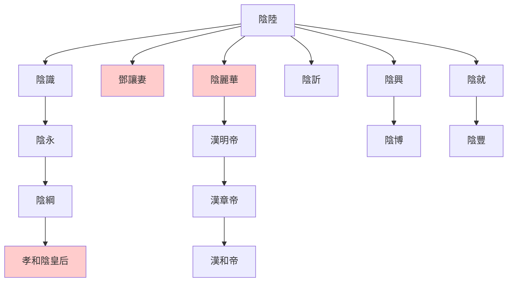

> 2021/8/17->2021/8/22

# 503 卷四十二 汉纪三十四

> 30->35

## 50301 斬董憲及公孫述定策
> 春，正月，丙辰，以舂陵乡为章陵县->由此大臣皆怨
- 漢朝名梗：代漢者當塗高。從西漢傳到三國，從未應驗
- 公孫述改幣制、啥都管、好改名、愛排場，完美繼承了王莽的特點。二逼思想易傳染，優良品德難為繼

## 50302 巾車之恩及隗囂反
> 冯异自长安入朝->诸军乃得还
- 蕪蔞亭豆粥，虖沱河麥飯，介子推大腿
- 隴坻之戰：隗囂初反，王元大敗漢軍七將，馬武斷後得脫

## 50303 久吏職及勝隗囂盧芳
> 六月辛卯->北地、上郡、安定皆降
- 物暴長者必夭折，功卒成者必亟壞。光武未平天下即採納百年老店的做法，不似某時四海平定還妄言多快好省

## 50304 竇融說擊隗囂
> 窦融复遣其弟友上书曰->皆解所假将军印绶

## 50305 馬援說隗囂
> 先是，马援闻隗嚣欲贰于汉->咸敬重焉

## 50306 隗囂投蜀及眾臣治國
> 隗嚣上疏谢曰->前有召父，后有杜母

## 50307 略陽之戰
> 春，来歙将二千馀人伐山开道->拜三子为郎
- 隗囂憑藉自爆英雄王捷，成功扭轉略陽之戰戰局

## 50308 祭遵隗嚣死及護羌校尉
> 十二月，高句麗王遣使朝貢->以牛邯為護羌校尉

## 50309 陰氏謙退及馮異死及降隗純
> 盜殺陰貴人母鄧氏及弟訢->庚午，車駕還宮
- 高峻反復小人，寇恂直接斬其來使，立降。兩國交戰不斬來使，只在需要說的時候說
- 陰氏世系

## 50310 荊門之戰
> 岑彭屯津鄉->大破之

## 50311 來歙遇刺及鮑永哭更始
> 公孙述以王元为将军->帝意乃释
- 欒布哭彭越，鮑永哭更始。劉邦喜歡嘚瑟，欒布進爵；光武低調，鮑永經人求情乃罷
- 來歙臨死力薦的段襄，人生最高光時刻為受來歙推薦

## 50312 征公孫述及岑彭遇刺
> 帝自将征公孙述->故伋言及之
- 來歙襲斬金梁，隗囂言：何其神也；岑彭襲破侯丹，公孫述言：是何神也。
- 兩漢第一刺客公孫述，亦何其神也
