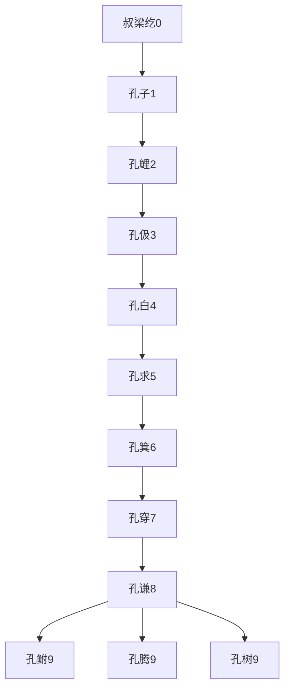
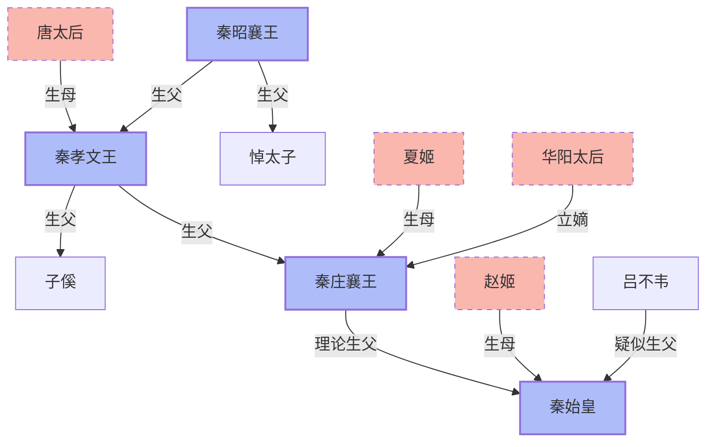

> 2020/10/18->2020/11/10

# 105 卷五 周纪五

> -272->-256

## 10501 阏与之戰
> 楚以左徒黄歇侍太子完为质于秦->以许历为国尉

## 10502 远交近攻
> 穰侯言客卿灶于秦王->与谋兵事

- 張儀、范雎，縱橫家都是先捱打再發達

## 10503 范雎用事
> 秦中更胡伤攻赵阏与->雎真倾危之士哉

## 10504 觸龍説趙太后
> 秦王以子安国君为太子->秦师退

## 10505 春申歸楚
> 齐安平君田单将赵师以伐燕->楚人纳州于秦以平

## 10506 長平之戰
> 武安君伐韩->赵人大震
- 赵括连亲妈都觉得不靠谱，尽力洗清关系而非怕他出事。
- 长平之战放归240老弱，用以制造秦国兵威的舆论。这其中应该有赵高吧…

## 10507 应侯武安构隙
> 十月，武安君分军为三->武安君由是与应侯有隙

## 10508 虞卿拒事秦
> 赵王将使赵郝约事于秦->赵王封虞卿以一城

## 10509 子顺相魏
> 秦之始伐赵也->天下其尽为秦乎

- 孔子世系简图(至秦)

- 新垣姓是毕公高之後，东野姓是周公之後，目前传至日本为新垣结衣与东野圭吾

## 10510 范雎报仇
> 秦王欲为应侯必报其仇->不任行

## 10511 邯郸之战起
> 正月，王陵攻邯郸->乃以王龁代王陵

- 范雎争权夺利，专搞人际关系，没有他白起应可迅速灭赵

## 10512 毛遂自薦
> 赵王使平原君求救于楚->魏王亦使将军晋鄙将兵十万救赵

- 毛遂愣头青，只宜吓唬江东鼠辈

## 10513 義不帝秦
> 秦王使谓魏王曰->不敢复言帝秦矣

## 10514 竊符救趙
> 燕武成王薨->终身不复见

- 朱亥40斤铁锤刺杀成功，张良120斤铁锤砸歪
- 白起说王不听他的败了吧？韩信说刘邦带兵不如他…说实话的最终都被杀了
- 魯仲連不愛財，學雷鋒只爲沽名釣譽
- 信陵君著急救趙很難是國際主義精神，或許是為救他姐有嫪毐之勇。

## 10515 吕不韦献赵姬
> 秦太子之妃曰华阳夫人->因更其名曰楚

- 秦始皇关系图

## 10516 周赧王崩
> 秦将军摎伐韩->赧王崩
