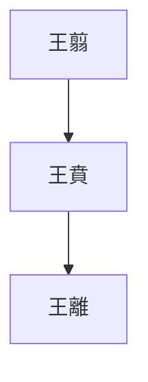
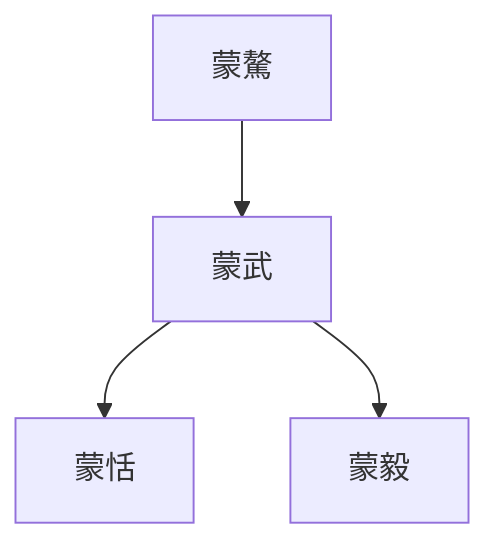
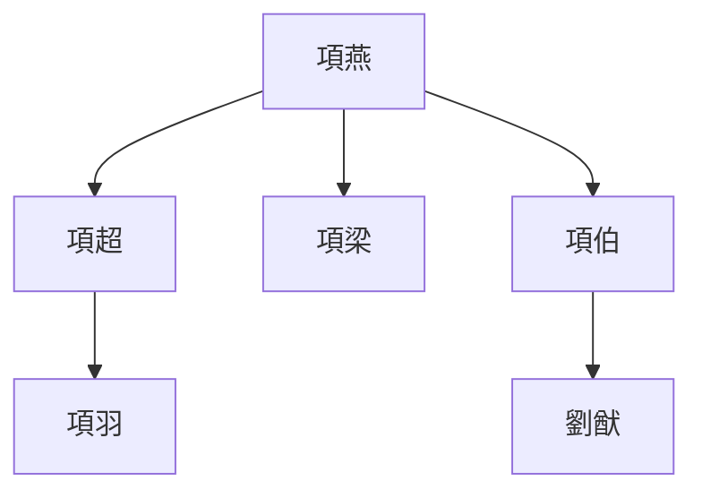

> 2020/12/7->2020/12/22

# 202 卷七 秦纪二

> -227->-209

## 20201 刺秦下
> 荆轲至咸阳->王复进兵攻之
- 刺秦闹剧：荆轲不知道杀还是不杀，最后没杀成反被杀；燕太子丹不忍杀人，最后被他爸杀；燕王喜杀儿子保国家，最后秒变亡国之君。

## 20202 秦灭魏
> 王贲伐楚->王义而许之
- 秦莊襄王名楚，所以後世諱楚為荊

## 20203 秦灭楚
> 李信攻平舆->以其地置楚郡
- 王翦家族

- 蒙驁家族

- 項燕家族

## 20204 灭燕赵定百越
> 大兴兵->天下大酺

## 20205 秦滅齊
> 初，齐君王后贤->岂不悖哉
- 君王后雖賢而不懂教育，巨嬰齊王建瞬間亡國

## 20206 初為皇帝
> 王初并天下->治驰道于天下

- 正名工作

原名|始皇名|今名
--|--|--
命|制|制度發布
令|詔|通知發布

- 五德終始
  - 原相生順序：伏羲木->神農火->黃帝土->少昊金->顓頊水->帝嚳木->帝尭火->帝舜土->夏金->商水->周木
  - 鄒衍說：周火
  - 始皇改相剋及後世：周火->秦水->漢土

- 分三十六郡。郡守總管，郡尉掌兵，郡監監察。
- 秦馳道廣50步，以2步1米算，大概相當於雙向六車道

## 20207 東巡
> 始皇东行郡、县->遂自南郡由武关归

- 秦始皇統一大業已成，閑來無事只好修仙，也是燃盡綜合症

## 20208 築長城
> 初，韩人张良->筑长城及处南越地
- 赘婿会被拉去修長城。在别人家淫乱男称寄豭

## 20209 焚书建阿房
> 丞相李斯上书曰->皆复不事十岁

## 20210 坑方士
> 卢生说始皇曰->使扶苏北监蒙恬军于上郡

## 20211 始皇病
> 有陨石于东郡->至平原津而病

## 20212 始皇死
> 始皇恶言死->太子胡亥袭位
- 一使者便能殺扶蘇，就算沒趙高也成不了氣候
- 秦始皇反映了人生三阶欲望：
  - 与人斗：和自己的一妈俩爸争权，成功
  - 与地斗：收六国之地，制六国之民，成功
  - 与天斗：求长生不死之术，失败

## 20213 始皇後事
> 九月，葬始皇于骊山->斯亦足称也

## 20214 二世屠宗室
> 冬，十月，戊寅，大赦->咸阳三百里内不得食其谷

## 20215 陳勝王
> 秋，七月->号张楚
- 秦郡县制官制
  - 郡：守、尉、监
  - 县：令、丞、尉

## 20216 陳勝驕
> 当是时->先生无累焉

## 20217 攻秦敗割據成
> 周文行收兵至关->狄人田儋起兵于齐

## 20218 劉邦早年
> 刘邦，字季->以应诸侯

## 20219 項羽早年
> 项梁者->籍是时年二十四

## 20220 六國復立
> 田儋者->卫绝祀
- 贯珠者、赵养卒，都是民间高手