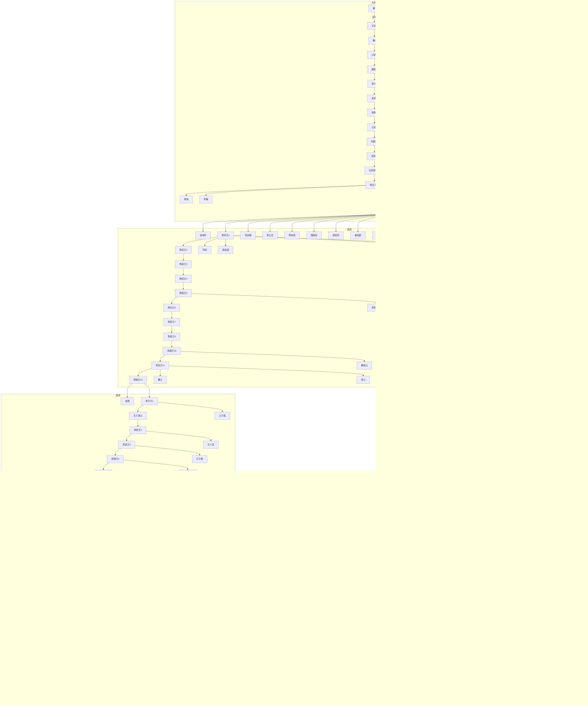

# 周朝世系圖

## 傳位圖

```mermaid
graph TB

subgraph 先周
    棄--后裔-->不窋
    不窋-->鞠
    鞠-->公劉
    公劉-->慶節
    慶節-->皇仆
    皇仆-->差弗
    差弗-->毀隃
    毀隃-->公非
    公非-->高圉
    高圉-->亞圉
    亞圉-->公叔祖類
    公叔祖類-->周太王
    周太王-->王季
    王季-->周文王
end

subgraph 西周
    周文王-->周武王
    周武王-->周成王
    周成王-->周康王
    周康王-->周昭王
    周昭王-->周穆王
    周穆王-->周共王
    周共王-->周懿王
    周懿王-->周孝王
    周孝王-->周夷王
    周夷王-->周厲王
    周厲王-->周宣王
    周宣王-->周幽王
end

subgraph 東周
    subgraph 春秋
        周幽王-->周平王
        周平王-->周桓王
        周桓王-->周莊王
        周莊王-->周僖王
        周僖王-->周惠王
        周惠王-->周襄王
        周襄王-->周頃王
        周頃王-->周匡王
        周匡王-->周定王
        周定王-->周簡王
        周簡王-->周靈王
        周靈王-->周景王
        周景王-->周悼王
        周悼王-->周敬王
    end
    subgraph 戰國
        周敬王-->周元王
        周元王-->周貞定王
        周貞定王-->周哀王
        周哀王-->周思王
        周思王-->周考王
        周考王-->周威烈王
        周威烈王-->周安王
        周安王-->周烈王
        周烈王-->周顯王
        周顯王-->周慎靚王
        周慎靚王-->周赧王
    end
end

```

## 關系圖

```mermaid
graph TB

subgraph 先周
    棄1--后裔-->不窋2
    不窋2-->鞠3
    鞠3-->公劉4
    公劉4-->慶節5
    慶節5-->皇仆6
    皇仆6-->差弗7
    差弗7-->毀隃8
    毀隃8-->公非9
    公非9-->高圉10
    高圉10-->亞圉11
    亞圉11-->公叔祖類12
    公叔祖類12-->周太王13
    周太王13-->泰伯
    周太王13-->仲雍
    周太王13-->王季14
    王季14-->周文王-1
    王季14-->虢仲
    王季14-->虢叔
end

subgraph 西周
    周文王-1-->伯邑考
    周文王-1-->周武王1
    周文王-1-->管叔鮮
    周文王-1-->周公旦
    周文王-1-->蔡叔度
    周文王-1-->衛康叔
    周文王-1-->郕叔武
    周文王-1-->霍叔處
    周文王-1-->毛叔鄭
    周文王-1-->冉季載
    周文王-1-->郜叔
    周文王-1-->雍伯
    周文王-1-->曹叔振鐸
    周文王-1-->錯叔繡
    周文王-1-->畢公高
    周文王-1-->原伯
    周文王-1-->豐侯
    周文王-1-->郇伯
    周武王1-->周成王2
    周武王1-->邘叔
    周武王1-->唐叔虞
    周武王1-->應侯
    周武王1-->韓侯
    周成王2-->周康王3
    周康王3-->周昭王4
    周昭王4-->周穆王5
    周穆王5-->周共王6
    周共王6-->周懿王7
    周穆王5-->周孝王8
    周懿王7-->周夷王9
    周夷王9-->周厲王10
    周厲王10-->周宣王11
    周厲王10-->鄭桓公
    周宣王11-->周幽王12
    周宣王11-->攜王
    周宣王11-->長父
end

subgraph 東周
    周幽王12-->伯服
    周幽王12-->周平王1
    周平王1-->太子洩父
    周平王1-->王子狐
    太子洩父-->周桓王2
    周桓王2-->周莊王3
    周桓王2-->王子克
    周莊王3-->周僖王4
    周莊王3-->王子頹
    周僖王4-->周惠王5
    周僖王4-->王叔文公
    周惠王5-->周襄王6
    周惠王5-->王子帶
    周襄王6-->周頃王7
    周襄王6-->王孫滿之父
    周頃王7-->周匡王8
    周頃王7-->周定王9
    周頃王7-->劉康公
    周頃王7-->王子捷
    王孫滿之父-->王孫滿
    周定王9-->周簡王10
    周簡王10-->周靈王11
    周簡王10-->儋季
    周靈王11-->太子晉
    周靈王11-->周景王12
    周靈王11-->王子佞夫
    周景王12-->太子壽
    周景王12-->王子朝
    周景王12-->周悼王13
    周景王12-->周敬王14
    
    周敬王14-->周元王15
    周元王15-->周貞定王16
    周貞定王16-->周哀王17
    周貞定王16-->周思王18
    周貞定王16-->周考王19
    周貞定王16-->西周桓公
    周考王19-->周威烈王20
    西周桓公-->西周威公
    周威烈王20-->周安王21
    西周威公-->西周惠公
    西周威公-->東周惠公
    周安王21-->周烈王22
    周安王21-->周顯王23
    西周惠公-->西周武公
    周顯王23-->周慎靚王24
    周慎靚王24-->周赧王25
end

```
